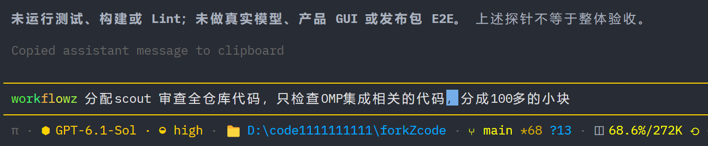
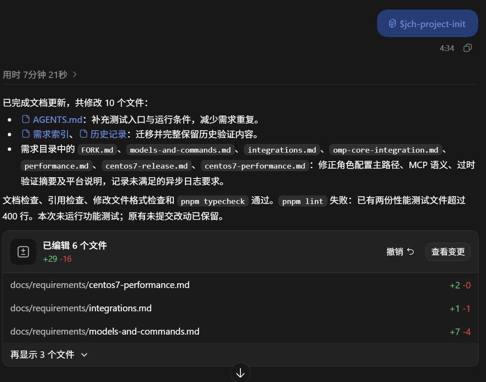
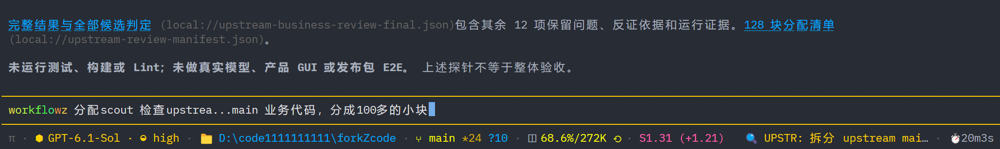
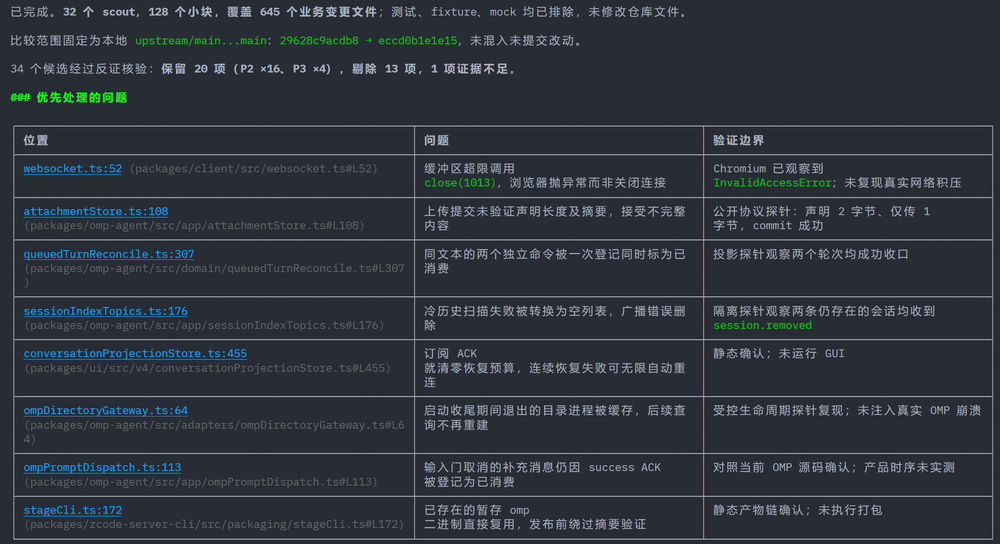
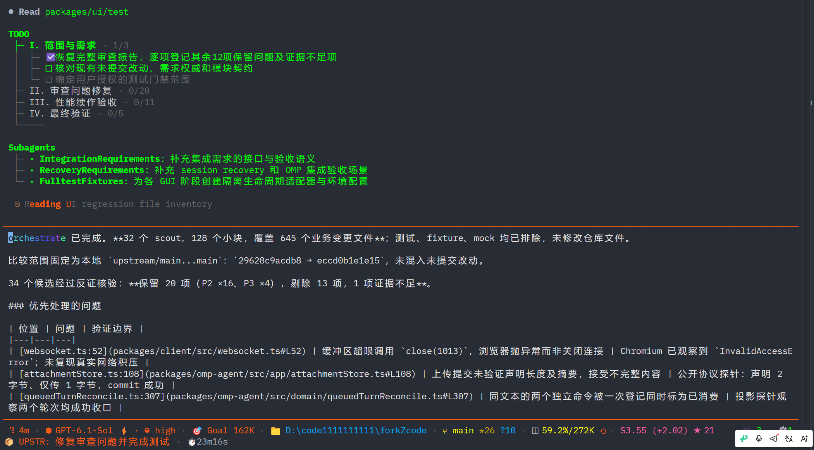
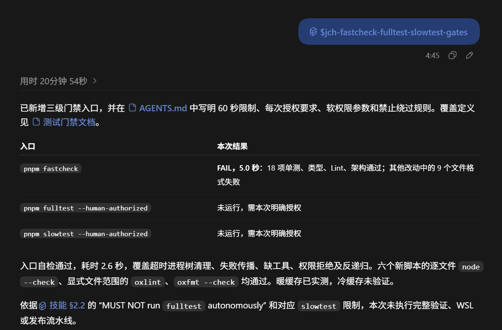

# 百万行代码仓库中的 AI 实践：工作流驱动的模块审查与并行修复编排

先交代一下这件事的背景和分量。

我长期维护的 oh-my-pi（omp）是一个开源终端 AI 编码代理：全仓 70 多万行代码，全部代码和文档都出自 AI 之手；我向上游提交了 40 多个 PR，其中 22 个已被合并。桌面版本则是我从零新建的独立仓库——不是 fork，不跟随上游合并，要支持 Windows 和公司红区里的 CentOS 7。

也就是说，这篇文章讲的实践，不是在几百行的 demo 仓库上跑通的演示，而是在这两个我本人已经读不完的真实仓库上，每天要用的流程。

“Review 一下整个仓库”或“分配 5 个子代理，每人一份代码”都没有解决关键问题：**怎样把大仓库拆成边界清楚、上下文装得下、结果可核对的任务。**核心是 OMP 的工作流内置命令：先把大型仓库按模块划分，再用工作流命令把模块拆成任意大小的审查单元——小到单文件也可以；理由是上下文注意力，AI 只关注单文件时效果最好，而关注单文件不代表不能阅读相关文件。审查按功能模块和业务流程拆分任务，用有并发上限的 agent 池执行大量相对独立的调查；修改由主代理编排，核对问题、处理依赖、统一集成验证。文中“100 万行、500 个任务、32 个并发”只是拆分示例；截图来自不同次任务，不构成一次完整验收记录。

## 一、直接 review 和平均分包都不行

“Review 整个仓库”没有可执行的范围：百万行代码远超单次上下文，没有清单就无法区分“没有问题”和“没有检查到”；只看入口不看状态落库、只测正常路径不测取消和恢复，也不算覆盖流程。

多分配几个子代理，如果只是把仓库平均分成 5 份，每个代理仍面对约 20 万行没有流程边界的代码——只是把一个大模糊任务换成几个小模糊任务。**并发上限限制同时运行的任务数，任务总数取决于问题怎样分解，两者不该绑定**：32 个名额不必把仓库恰好分成 32 份。先拆任务，再安排资源。

## 二、先找到功能模块和业务边界

模块按业务职责划分，不与目录一一对应，代码常分散在不同目录共同完成一条流程。审查前先弄清：入口在哪、请求经过哪些组件、什么状态变化、结果在哪观察、失败取消恢复怎么处理。**定位可以跨全仓库，深入审查只限目标模块及必需依赖。**



### 需求文档最重要：不是人写的，但必须由人澄清

**项目全程交给 AI 之后，最需要维护的是需求文档，而不是代码。** 读写代码、跑验证都可以交给代理，“应该做成什么、不做哪些、到什么程度算完成”只有需求文档能回答；它一旦失真，所有审查和修复都在核对错误的预期。缺少需求，代理就会把当前实现当预期：代码怎么写，就认为应该怎么运行。

需求文档不由人执笔，由两个本地技能维护（都不是 OMP 内置命令，需先安装；`jch-project-init` 不带参数、处理当前项目；截图中的 `$jch-project-init` 是另一宿主入口）：

- **`jch-project-init`**（有时简称 jch-init，调用名 `/skill:jch-project-init`）建立并日常维护基线：多层级 `AGENTS.md`（全仓含根最多 8 份，子文档不复制根规则）加固定需求目录（自有项目放产品需求，fork 放本地差异需求；按功能域拆分，每条需求只有一个权威位置）。已有的有效需求与实现冲突时保留需求、标出差距；未实现的规划也保留，不能把需求改成代码的样子。
- **`jch-requirements-interview-rebuild`**（`/skill:jch-requirements-interview-rebuild`）逐项重新确认：文档、代码、测试三方一致，也不代表需求就是我真正需要的——代理擅自选的默认行为、过时的需求、一句话里没确认过的选择，只有我能裁决。它一次只问一个决策问题，每问给出推荐与备选；确认后按功能边界重建文档。从实现还原的需求在访谈里只是草稿。



两个技能只维护文档，不改业务代码、不跑测试、不提交推送。基线建立后，主代理应把相关需求提供给子代理，而不是假定它们自动拥有主代理的上下文。

## 三、把模块拆成可以回答的流程问题

“审查会话模块”仍然太大，要拆成具体问题：入口校验是否正确、状态转换与返回是否一致、中断后是否仍执行后续动作、失败是否被误报为成功、重试有没有退出条件。每个审查单元至少写明：

- **目标**：检查哪条流程、哪类行为；
- **范围**：入口、关键实现和直接依赖；
- **约束**：只读、不改代码、不扩大范围；
- **输出**：问题位置、触发条件、证据与验证边界。

按问题保留最小完整流程，不能机械按行数切割。

## 四、500 个任务，32 个并发位置

100 万行拆成 500 个任务，平均每项 2000 行，这只是尺度参考——接口、调用方、需求和工具输出同样占上下文。**任务清单描述做什么，agent 池安排谁来做、何时做；并发上限不是审查覆盖率。**

拆好的任务用一个上限为 32 的 agent 池执行：池管理的只是**并发位置**，同时运行不超过 32 个，一个完成立即补位。每项审查都应使用新的任务上下文，只携带统一审查规则、自己的范围和必要资料，避免上一项调查的推断、临时假设和工具输出影响下一项——不要让同一个代理带着越来越长的对话连续审查几十个模块。注意 OMP 的 `workpool()` 默认复用常驻 worker，要真正逐任务新代理需显式设 `eval.workpool.freshAgents=true`。无论是否复用，每项任务都要自包含目标、范围、约束和输出。

工作流命令可以把模块拆成任意大小的单元，直至单文件；拆到单文件的收益就是上下文注意力——代理只关注一个文件时判断最好。这次审查按变更文件拆分：每个子代理以分配到的文件为责任重点，但**可以阅读任意相关的其他文件**——判断需要调用方、接口定义或相邻实现时就去读。因此“一个文件一个代理”不等于“只能看到单个文件”，跨文件问题不会天然掉进拆分缝隙；要写进任务要求的是：以当前文件为重点，追读完上下游再下结论。


并发上限受 `task.maxConcurrency`、服务限流和机器资源约束。**先保证任务边界合理，再调并发；更多代理救不了错误的拆分。**

## 五、用 `workflowz` 批量审查

`workflowz` 不是“只读审查模式”：它向模型追加工作流指令，要求优先用持久化 Eval 内核的 `workpool()`（即 agent 池）批量处理独立事项（也可用于迁移、研究、方案比较），有依赖或需要结构化返回值时用 `agent()` 句柄衔接。通知要求会话同时启用 `eval` 与 `task`，受 magic keyword 设置控制；关键词只提供指令，真正决定队列与并发的是实际调用的工具。

```text
/workflowz 先定位 OMP 集成模块的入口、接口和关键流程，再按业务问题建立审查清单。只读，不修改代码，不调查无关模块。用上限 32 的 scout agent 池逐批执行，每个任务使用新的上下文；每项任务注明范围和输出要求。收齐结果后核对证据，汇总确认问题、待核实项、覆盖范围和未完成项。
```



执行期间主代理继续核对已返回的证据、归并重复候选；结果自动送回，不靠轮询。队列清空只是阶段边界，不是任务完成。

## 六、收齐意见后逐项核对证据

并行审查会给出大量重复或错误的候选。逐项核对：根因是否重复报告、源码和需求是否支持、触发条件是否成立、上下游是否已处理、证据来自静态阅读、局部探针还是实际运行、哪些任务失败未完成。“多个代理都提到”不证明问题成立——它们可能共享同一个错误前提。用于修复的报告分四类：**确认问题**（有证据，进修复）、**待核实**（先调查再改）、**剔除项**（说明为什么不是问题）、**未覆盖范围**。

下面这份报告自述用了 32 个 scout、128 个审查块覆盖 645 个业务变更文件，34 个候选复核后保留 20 项、剔除 13 项、1 项证据不足：



这是当次报告的统计，不是独立验证过的覆盖率；有的条目有局部探针支持，有的只经静态确认，不能都算“真实流程已复现”。

## 七、用 `orchestrate` 协调修复

确认的问题进入修复时要重新划分任务，不能把审查清单平均分配：接口被别的任务依赖、两个任务改同一文件、局部修复改变错误传播——这些都要协调。`orchestrate` 向模型追加主代理协调要求（列全范围、拆分委派、核对结果、按阶段验证），主要通过 `task` 工具派发子代理；它同样能组织只读审查。

```text
/orchestrate 根据已核实的审查报告修复问题。先逐项列出确认问题和验收条件，划清独立修改范围与共享接口的归属。并行委派独立任务，有真实依赖的任务按顺序衔接。子代理不各自运行构建、测试或格式化，由主代理统一执行项目规则允许且已授权的验证；未确认问题不直接据此修改。
```

主代理不必自己改完所有代码，但必须承担集成责任：每项任务有目标和验收条件、共享文件有唯一修改负责人、下游拿到接口约定、调用方需求测试随变更同步、合并后统一验证。**并行是手段，编排是对任务的组织。**



## 八、每晚回家的无人监督优化循环

以上流程都需要我在场。用本地技能 `jch-expert-review-and-fix-loop` 可以把其中一部分放到无人监督的时间段——我每天晚上回来后启动，让它对指定范围自动优化代码：

```text
/skill:jch-expert-review-fix-loop
```

它持续运行“审查 → 确认 → 修复 → 交叉审查 → 验证”循环，直到没有有证据的缺陷和有实际收益的优化，无轮数上限；并发默认 8，自动修复默认开启。显式调用在本任务内授权项目各级测试（项目契约允许时含完整验证层级），这是无人值守的前提；提交推送只在验证前置条件需要时发生。角色边界固定：派发审查前先过快速门禁清掉机械问题；审查代理只读、不跑测试；一个文件只有一个写入者；每个修改由未参与编写的新代理交叉审查；测试集中在独立验证阶段，迭代用最便宜够用的层级。

它只修有证据、有真实影响的问题：风格偏好和投机型优化不算缺陷，低风险项登记不修，没有问题是合法结果。轮次验收有硬计数：覆盖完整、无未决候选、全部交叉审查和验证通过才加一，任何代码改动归零，连续两轮干净才算通过。状态存在工作树外的检查点里，中断可恢复，报告数字对照台账核对。结束时只交简短结果（验证命令与退出码、未验证项、剩余风险），不需要我读代码或手工回归。

## 九、用 32 个专家团并行修复超大仓库

夜间循环追求“修到没有候选问题”，另一端是“尽快修完”。本地技能 `jch-parallel-review-fix` 用来快速修复超大型仓库的问题：

```text
/skill:jch-parallel-review-fix
```

输入范围和最大并发子代理数（我通常给 32；它只限制同时运行数，不是专家团人数也不是任务总数）。主代理只做分区、协调和交接：按功能边界划分互不重叠的任务卡（任务 ID、工作目录、审查文件、允许修改文件、只读依赖、规则与需求路径、汇报对象），子代理自己读规则、不继承主对话；主代理不亲自审查或修复。

每个子代理独立完成“审查 → 定位 → 最小修复 → 复查 → 轻量检查”：能修的直接修掉，不报回来等主代理；可读任意模块理解依赖，但只能改分配范围内的文件，越界或动共享接口时暂停上报。一个文件同一时刻只有一个所有者，紧耦合任务合并，有依赖的按顺序执行。

该技能内所有人（含主代理）都不跑任何测试——项目快速门禁也移交给验收代理；只对改动文件跑静态检查和格式化，每条命令 60 秒硬上限；新增回归测试登记为未验证。结束时汇总覆盖与未覆盖范围、改动、阻塞项，明确写出“设计上未运行任何测试”，留下给验收代理的交接。**审查修复完成不等于测试验收。**

## 十、按业务结果验收

“启动了多少代理、读了多少文件”回答不了验收；要回答的是：目标流程的问题是否修复、相关行为是否保持正确、哪些没验证。测试通过、构建通过、真实入口验证是不同层次的证据；未运行的检查必须写明，不能用局部探针替代整体验收。

### 把验证放进三级门禁

小改动跑全流水线太慢，只跑快检又不够验收。我用本地技能 `jch-fastcheck-fulltest-slowtest-gates`（需预先安装并显式调用，调查项目现有能力建立入口）分三级：

| 层级 | 目的 | 边界 |
| --- | --- | --- |
| `fastcheck` | 高频快速反馈 | AI 可自主执行；单次墙钟 ≤ 60 秒，超时失败并清理进程树 |
| `fulltest` | 当前平台完整本地验证 | 须人工授权，不触发其他平台或远端流水线 |
| `slowtest` | 综合验收 | 含 `fulltest` 及跨环境、远端或发布流程；须人工授权 |

**技能方案与仓库现状要分开**：本 OMP fork 的 `fastcheck` 没有 60 秒时限，`fulltest` 按 `upstream` 基线差异选测试，`slowtest` 含 WSL 验证与构建发布，以[根 AGENTS.md](../AGENTS.md#验证) 为准。调用技能也不等于授权运行测试；脚本里的授权标记代替不了用户授权。



修复结果按实际证据交付：哪个快照、跑了什么、通过失败什么、哪些边界没验证；不把不同环境下的局部通过拼成整体通过。

## 结语

大型仓库的 AI 审查不是一次超长聊天，也不是把代码平均分给几个代理：先按业务问题拆清单，按依赖安排执行，用证据核对问题，用真实业务结果验收。需求文档回答“应该做成什么”——最重要、不由人执笔、必须由人澄清；验证门禁回答“怎样检查”；`workflowz`、`orchestrate` 和两个修复技能负责组织执行。

## 项目与实现参考

- **CLI（终端版）**：[oh-my-pi](https://github.com/jchanghong023/oh-my-pi)，本文使用的 OMP fork。
- **桌面 App**：[OmpCode](https://github.com/jchanghong023/OmpCode)，内置 OMP 核心，无需另装 CLI。提供 **CentOS 7 x64 专用兼容 ZIP**，可由普通用户解压后离线运行，无需 root 或升级系统 glibc；仍需图形会话和系统桌面库。
- **关键词与执行指令**：[magic keywords 文档](../docs/magic-keywords.md)、[`workflowz` 通知](../packages/coding-agent/src/prompts/system/workflow-notice.md)、[`orchestrate` 通知](../packages/coding-agent/src/prompts/system/orchestrate-notice.md)；本 fork 斜杠命令见[需求约定](requirements/fork.md#魔法关键词的内置命令与-fullsend)。

CentOS 7 兼容包使用已停止维护的 Electron 28，并关闭 Chromium 沙箱，仅用于可信工作区。公司 Citrix 图形环境尚未验证；下载和运行方法见 OmpCode 项目 README。
