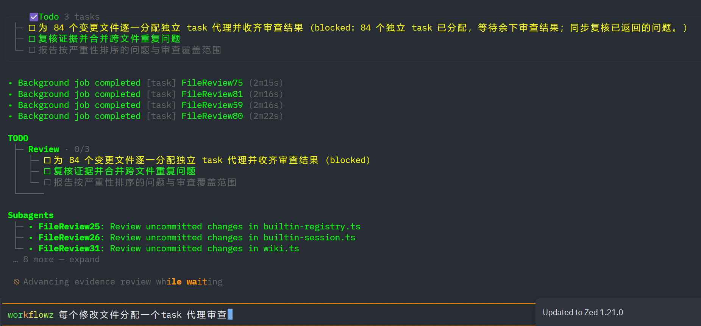

# 公司内网 OMP 新手快速指南（Linux / tcsh）

## 1. 设置环境变量

在启动 OMP 的终端执行：

```tcsh
setenv OMP_OFFLINE 1
setenv OMP_CONFIG_ROOT "$HOME/omp-data"
```

- `OMP_OFFLINE`：启用公司内网模式。
- `OMP_CONFIG_ROOT`：数据目录，可换成有写权限的绝对路径；旧数据不会自动搬过来。

这两行可放进 `~/.tcshrc`，以后新终端自动生效。

## 2. 启动

**先启动 IDE 和模型代理，否则模型用不了：**

```tcsh
ma dmas_ide
ide agent
```

代理就绪后，进入自己的项目目录（替换示例路径）：

```tcsh
cd /path/to/project
omp
```

继续上次会话用 `omp -c`。OMP 自动复用 Claude Code 的公司配置，无需再登录。

## 3. 常用操作

以下在 **OMP 输入框**使用。直接输入任务，按 `Enter` 发送；输入 `/` 补全命令，输入 `@` 选择文件。

| 按键 / 命令 | 用途 |
| --- | --- |
| `Ctrl+T` 或 `/switch` | 查看、临时切换当前会话模型 |
| `/model` | 设置各角色模型 |
| `Shift+Tab` 或 `/plan` | 切换计划模式，先出方案 |
| `Ctrl+O` | 展开 / 收起工具调用详情 |
| `Esc` | 中断当前操作；循环模式下暂停循环 |
| `/tree` | 查看、切换会话分支 |
| `/copy` | 选择并复制对话内容 |
| `/copy code` | 复制最近的代码块 |
| `/new` | 新建会话 |
| `/resume` | 恢复历史会话 |
| `/context` / `/compact` | 查看上下文占用 / 压缩上下文 |
| `/wiki` | 查询已导入的公司资料 |
| `/repo` | 建立、更新代码定位索引 |
| `/team 需求` | 多模型独立调查、交叉审查并汇总方案，只读 |
| `/advisor on` / `/advisor off` | 开启 / 关闭第二模型的逐轮复审 |
| `/skill:技能名 任务` | 调用本地技能，从补全中选择技能名 |
| `/todo` / `/hub` | 查看待办进度 / 子代理活动 |
| `/queue 后续任务` | 当前轮结束后再执行；空闲时直接执行 |
| `/quit` | 退出 |

运行中想排队，也可输入消息后按 `Ctrl+Q`；普通 `Enter` 会引导当前任务。快捷键失效时用 `/hotkeys` 查看绑定。

这四个命令可以**直接带任务文本**：

| 命令 | 用途 | 可复制示例 |
| --- | --- | --- |
| `/ultrathink` | 深入分析再行动 | `/ultrathink 分析这个错误的根因，给出证据和修复方案` |
| `/orchestrate` | 拆分任务、委派子代理、整合验证 | `/orchestrate 按 @a.md 实现，拆分独立任务并行完成，统一验证` |
| `/workflowz` | 按阶段组织批量多代理任务 | `/workflowz 按模块检查当前仓库，汇总有证据的功能问题，只读` |
| `/fullsend` | 优先速度与验证质量，不以成本或 token 用量为约束 | `/fullsend 按 @a.md 完成实现和必要验证，修复问题后复测` |

这些命令向模型追加任务要求；`/orchestrate` 依赖 `task` 工具，`/workflowz` 依赖 `task` 和 `eval` 工具，相关设置也需启用。

## 4. 直接复制的例子

**多模型讨论方案：**

```text
/team @a.md 结合现有代码和内部 wiki，比较可行方案，给出推荐和验收条件。
```

内网默认使用可用的公司模型；先用 `Ctrl+T` 选好汇总方案的主模型。`/team` 只做规划，实现时再发 `/goal` 等任务。

**用索引定位代码：**

先输入 `/repo`，确认仓库目录并建立索引；切分支或外部批量改动后，在面板更新。然后输入：

```text
用 repo 定位当前项目中读取配置的代码，再读取源码解释处理流程。
```

**开启逐轮复审：**

```text
/advisor on
```

`/advisor status` 查看状态，`/advisor off` 关闭。提示缺少模型时，用 `/model` 设置 advisor 角色。

**解释文件：**

```text
@a.md 解释这个文件的用途和主要流程，只读，不修改。
```

**最多重复 3 轮：**

```text
/loop 3 hello
```

**最多检查、修复 5 轮：**

```text
/loop 5 检查当前改动，发现明确功能问题就修复，然后重新检查；没有问题就不要做无关修改
```

按 `Esc` 暂停，输入 `/loop` 关闭。循环已开启时，再次输入 `/loop ...` 会关闭它；“没有问题”不会自动提前终止循环。

**按方案实现、测试并独立复审（先确认项目里有 `a.md`）：**

```text
/goal @a.md 按方案实现所有代码，补充必要的测试；必须覆盖所有主要接口，必须通过所有 UT，完成代码后必须分配独立子代理对你的代码进行检查。
```

先退出计划模式。用 `/goal show` 看状态，`/goal pause` 暂停，`/goal resume` 继续，`/goal drop` 删除目标（保留代码改动）。测试结果和子代理过程以实际输出为准。

**工作流使用例子：**

```text
/workflowz 每个修改文件分配一个 task 代理审查
```



**查看子代理和任务进度：**

```text
分配一个独立子代理，让它返回 hello。用 todo 工具跟踪进度。
```

用 `/hub` 看子代理，`/todo` 看进度。

## 5. 用不了时

- **模型不可用**：先确认 IDE 和代理已启动；在系统终端运行 `omp models`，检查是否有 `company` 模型及错误提示。
- **公司配置错误**：检查 `~/.claude/settings.json` 的 `env.ANTHROPIC_BASE_URL`、`env.ANTHROPIC_AUTH_TOKEN`，改完重启 OMP。配置在其他目录时设置 `CLAUDE_CONFIG_DIR`。
- **旧会话找不到**：确认项目目录和 `OMP_CONFIG_ROOT` 与之前一致；`omp config path` 查看配置目录，已有 `PI_CODING_AGENT_DIR` / XDG 配置也可能影响存储位置。
- **复制失败**：直接选择终端文本复制。

内网使用本地技能和公司资料，不使用公网搜索、在线安装或更新。
