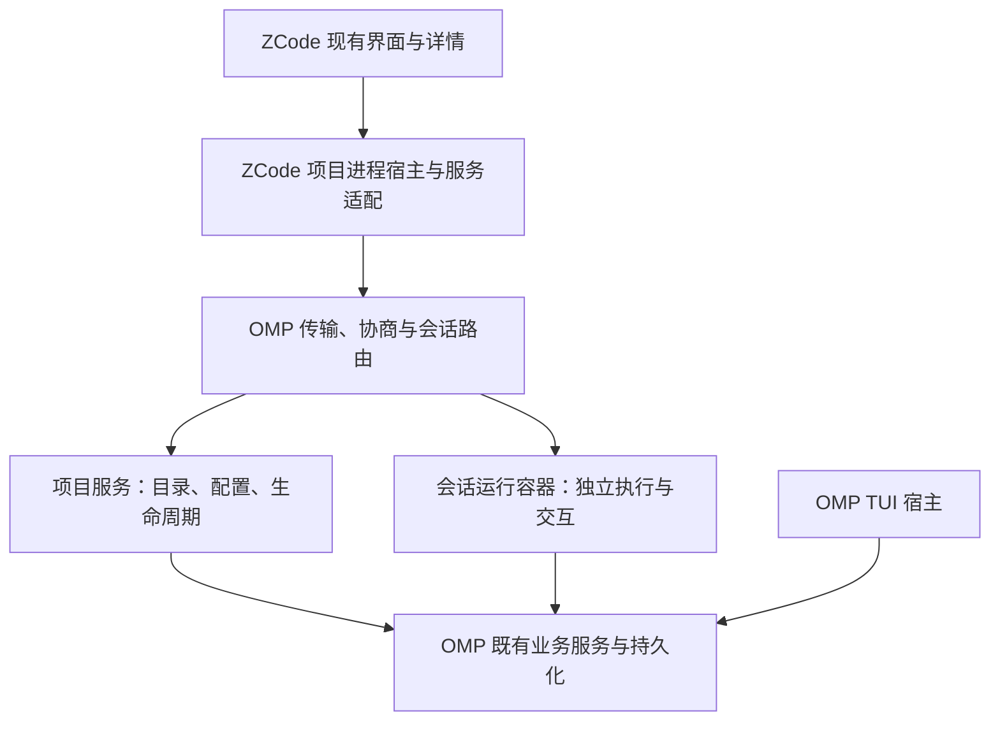

# rpc-ui 协议与项目运行服务：需求、架构与实施设计

> 目标：用本 fork 的 OMP 替换 ZCode 内部 Agent CLI，保留 ZCode 的现有核心界面与交互，并充分开放 OMP 自身的命令、技能与多代理能力。ZCode 现有功能是接入基线，不是 OMP RPC 能力上限。
>
> 本文件是该功能域的唯一权威需求与架构设计。接口名称表示目标契约，不表示已经实现。2026-09-29 完成需求、架构和接口设计；同日完成 OMP 侧项目模式首轮实施（见 §17.3 实施状态），ZCode 侧接入（Z1/Z2）尚未开始。已有实现不自动等于设计正确，也不自动等于验收通过。

阅读顺序：§1—§3 明确目标和边界，§4—§9 定义行为与兼容，§13—§16 给出架构、参数和事件流程，§10、§17 指导实施，§11 提供验收编号。新增设计字段不代表现有 RPC 已支持。

## 1. 需求背景与范围

ZCode 负责桌面界面和调用适配，OMP 负责 Agent 的业务运行与权威状态。协议不同本身不是阻塞；只有调用层无法可靠补足的运行能力才需要修改 OMP。

### 1.1 最高优先级：五项高频核心功能

**以下五项是用户明确指定的核心交付，必须逐项编码、逐项完成真实 GUI 验收，任何一项缺失都不能宣称核心接入完成。**

1. **发普通消息**：发送、流式回答、工具过程、停止和历史恢复。
2. **调用技能，必须有补全**：能发现技能、提示名称和参数、选中后正确调用。
3. **使用内置命令，必须有补全**：覆盖 OMP 上游和 fork 的业务命令，支持提示、补全、执行及必要交互。
4. **看子代理运行过程**：状态卡片、每次工具调用与结果、代理间通信、实时详细过程、已结束记录和重启后历史恢复；不得退化为只显示摘要或最终答案。
5. **切模型与配置 role 模型**：当前会话临时切换不写模型配置文件；界面显示全部可配置 role，包括未配置项；修改某个 role 后自动写入 OMP 配置文件。

**两种模型操作必须分开：临时切换仅改变当前会话；修改 role 是持久配置操作。不得共用一个隐含写配置的按钮行为。**

每项目单主进程、多会话继续作为架构约束。技能安装、复制、删除等管理功能保留，但实施优先级低于上述五项，不得以管理页面完成代替核心场景完成。

### 1.2 OMP 能力优先，GUI 按能力适配

**五项核心功能决定交付顺序，不构成协议功能白名单。OMP RPC 面向 OMP 自身的业务语义设计，ZCode 调用层适配 OMP；不得为了套入 ZCode 旧协议而丢失 OMP 已有功能、事件或操作语义。**

- 对命令、技能和多代理相关能力，实施前以当前源码为准核对 TUI 入口、公共业务服务、RPC 入口及 GUI 呈现，逐项标明已覆盖、待开放、宿主动作或确有运行限制；不能把未接入当作不支持。
- OMP 已有业务服务优先复用。只在 RPC 缺少调用入口、可发现元数据、交互闭环或必要事实事件时补接口；GUI 展示布局、交互组织及兼容旧界面的映射留在 ZCode。
- 保留现有主要界面与使用习惯，允许在详情、命令交互及操作入口中增加呈现 OMP 能力所需的内容；“界面不变”不能解释为静默删除 OMP 数据。无需为每个命令新建设置页，也无需将终端绘制、快捷键和屏幕控制转成 RPC。
- 本期不新增独立协作引擎或工作流产品；这不排除开放和呈现 OMP 已有的代理通信、协作及控制能力。其他明确排除的新产品范围继续按本节执行。

### 1.3 需求追踪

| 编号 | 需求 | 完成条件 |
| --- | --- | --- |
| R1 | 在界面管理 OMP 技能 | 列表、启停、复制、删除与实际技能解析一致；已有安装、更新、卸载业务可经命令使用 |
| R2 | 在 GUI 使用 OMP 内置命令与技能 | 命令说明、参数提示、补全、执行和必要交互可用；覆盖上游及 fork 的 TUI 斜杠命令 |
| R3 | 一个项目一个 OMP 主进程，多个会话 | 新建会话不增加 OMP 主进程；多个会话共存并独立执行、取消、关闭和恢复 |
| R4 | 普通消息完整执行链路 | 发送、流式显示、工具过程、停止、失败提示和历史恢复可用，接受请求与执行完成不混淆 |
| R5 | 查看子代理运行过程 | 显示运行状态与进度，点击打开只读详细过程；已结束及重启后的历史子代理仍可发现并查看，多个父会话不串流 |
| R6 | **临时切模型与全部 role 模型配置** | **临时切换不写模型配置；全部可配置 role 始终可见，修改后自动持久化；实际生效模型、配置值和保存结果明确区分** |

“一个进程”指承载会话的 OMP 主进程，不禁止工具、终端、MCP 的必要子进程。会话数量不与主进程数量绑定，不承诺无限驻留。“内置命令”指 TUI 输入框命令，不要求将全部 shell CLI 子命令变成 GUI 功能。

现有消息、模型、工具、审批、ask、历史、队列等运行能力是替换基础，继续接入；本期不新增聊天或编程产品流程。绘画、桌面远程控制、SSH 工作区、工作流平台、调度器、机器人渠道、付费体系、远程事件回放不属于本需求。旧文档中这些 P2 项不再是本功能域的有效待办，不得借本次接入实施。

“保持界面”指保持上述核心功能的既有组件与操作方式，不要求 OMP 复刻 ZCode 全部产品域。非核心页面的显示策略由 ZCode 处理，不产生 OMP 新能力要求。

## 2. 源码核对与协议结论

### 2.1 审阅基线

| 对象 | 基线 |
| --- | --- |
| 用户 fork | `a2d6b9e50bf28705df2e20561934a25b3899c1e4`，本轮核心场景、子代理及模型需求补充前 |
| fork 上游基线 | `fc671eba383f2a7208500836673b485c0dc7073d`，v18.4.3；后续以 `fork.md` 为准 |
| ZCode | `29628c9acdb81b703bbd4080c207a0e7ce5e276e` |

架构补充审阅基线为 `7baadeb680962c9d59eb3d8e50a317af5729d460`；此前两次提交仅改文档，运行代码与上表 fork 基线一致。编码前重新核对版本差异，不能用早期上游副本推断本 fork 的实现状态。

### 2.2 ZCode CLI 的实际接口形式

ZCode 本地调用由服务层管理工作区进程，启动 `app-server --stdio`，经标准输入输出传递协议消息。请求外壳包含 `id/method/params` 等信息；不能因为形式类似 JSON-RPC，就认定它与 OMP 的 `type` 命令协议相同。

其 v4 接口同时存在三类机制：

- 结构化业务命令：命令信封含命令身份、会话身份、类型和业务载荷；ACK 区分接受、拒绝、陈旧、重复等结果。接受不等于业务执行完成。
- 查询：会话、历史范围、计划等有独立读接口，不要求全部转换成输入框文字。
- 订阅：会话、会话目录、工作区配置等由快照和增量帧更新，包含订阅与恢复信息。

技能也不是全部由 CLI 管理：ZCode 有独立 `ISkillsService`，提供列表、启停、复制和删除；Agent 服务另提供带会话有效快照语义的技能引用目录。因此不能照抄 ZCode 服务方法就要求 OMP 新增同名 RPC，也不能把“ZCode 自己能操作文件”推导成“ZCode 应自行实现 OMP 技能解析与刷新”。

ZCode 存在 CLI 反馈命令和计划查询。它们的存在只证明 ZCode 的业务归属，不能证明 OMP 必须提供同样接口。是否保留须看 OMP 是否拥有对应语义与状态。

### 2.3 本方案采用的结论

1. OMP 继续使用自己的 rpc-ui 传输与业务协议；不实现 ZCode v4 的 rows、delta、订阅主题、命令日志或线协议。
2. ZCode 调用层把 OMP 数据转换成界面需要的服务结果和更新；已有上层订阅形式需要保持时，在 ZCode 适配层完成投影。
3. OMP 必须提供真实状态、明确会话归属、可恢复读取和操作结果。调用层不能凭空补出这些事实。
4. 结构化 GUI 管理接口与斜杠命令可以并存，并调用同一业务服务。接口数量少不是正确性的标准；禁止为了少一个接口让 GUI 解析终端文案。
5. 不迁移 ZCode 的全部协议保障。只实现本地单宿主连接、多会话共存所需的一致性，不引入远程多客户端系统。

## 3. 分仓职责与接口取舍

### 3.1 归属规则

| 能力 | OMP | ZCode |
| --- | --- | --- |
| 项目进程 | 单进程承载多个会话、隔离运行状态 | 按项目启动、复用、退出和重启主进程 |
| 会话 | 创建、加载、卸载、历史、名称和运行状态 | 选中会话、页签、排序、跨项目汇总 |
| 技能 | 来源解析、启停、生效视图、管理操作与刷新 | 现有管理界面、产品目录映射、展示与用户输入 |
| 命令 | 目录、动态补全、语义解析和执行 | 提示面板、静态过滤、光标和弹窗呈现 |
| 状态更新 | 事实事件、快照和明确身份 | 合并事件、生成界面行、订阅投影与缓存 |
| 模型与 role | 当前会话模型切换、完整 role 元数据、解析校验、逐 role 持久化和生效事实 | 两种独立操作入口、全部 role 展示、候选筛选及保存状态 |
| 子代理查看 | 运行事件、可恢复的父子关系/终态和记录查询 | 状态卡片、运行/已结束目录、只读侧栏、OMP 数据到现有 UI 的映射 |
| 本地文件 | 返回 OMP 管理资源身份及必要定位 | 通用读取、编辑、搜索、文件打开 |
| 桌面行为 | 返回宿主动作意图 | 剪贴板、外部编辑器、窗口、文件选择器 |

审批、ask、队列、任务、配置、模型与 MCP 等真实 OMP 状态仍归 OMP。业务服务缺入口时补 RPC；UI 字段或方法名不同仅在 ZCode 适配。

### 3.2 对已有及曾拟新增接口的最终裁定

| 项目 | 裁定 | 编码要求 |
| --- | --- | --- |
| `submit_feedback` | 从本期 OMP 需求删除 | 当前仅本地记录赞踩，未定义 OMP 消费语义；ZCode 自行存储其界面反馈。旧入口按 §9 兼容，不继续扩展 |
| `search_paths` | 从本期 OMP 必需能力删除 | 通用本地文件搜索留在 ZCode；不能用远程场景作为本期理由。OMP 命令自己的参数补全仍由 OMP 提供 |
| `read_plan` | 不作为新接入依赖 | 本地计划文件可由 ZCode 文件服务读取；OMP 仍提供计划身份、定位、状态和审批版本。将来若有独立资源语义再评审，不新建通用文件代理 |
| `pin_session/unpin_session` | 不要求项目模式扩展 | 置顶是本期 ZCode 展示偏好；未要求 TUI 与 GUI 共享置顶。保留旧入口兼容，不双写 |
| 会话归档、分组、已读未读 | 从 OMP 规划删除 | 本期由 ZCode 按项目与会话身份存储 |
| `set_approval_mode` | 保留并修正 | 会话运行档位与持久默认设置分离；改变 A 不隐式修改 B 或用户默认值 |
| `approve_plan` | 保留并修正 | 绑定会话、待审批身份与内容修订；拒绝过期审批，关联后续执行结果 |
| `rename_session/delete_session` | 保留并修正 | 项目模式使用会话身份；客户端不以任意文件路径控制 OMP 存储 |
| `set_skill_source_enabled/set_skill_ignored` | 保留业务语义 | 来源级开关、按名称忽略、具体技能开关不混为一谈；统一解析和生效服务 |
| `mcp_reconnect` | 归属合理，语义需真实 | 未实际触发时不能报告已开始重连；不支持则明确返回不支持，不能伪造成功 |
| `queue_updated/sessions_changed` | 保留并完善 | 从实际状态变化发出，覆盖运行时自身变化，不只覆盖 GUI 请求 |
| 技能结构化管理接口 | 必要的保留 | 列表、启停、复制、删除独立结构化入口合理，与 TUI 共用业务服务 |
| 安装、更新、卸载接口 | 不强制三套新入口 | 本期经通用命令暴露已有业务；若接入既有管理按钮确需结构化入口，可包装同一服务，不能要求按钮拼接脆弱字符串或解析 TUI 文案 |
| Provider、设置、MCP、用量、goal、hook | 归属合理，复用已有能力 | 多会话涉及的作用域与事件归属需修正；不因归属合理而全面扩建管理产品 |
| ZCode v4 wire、远程回放、常驻 daemon、多客户端 attach | 从本期需求删除 | 由本地项目进程和现有持久化恢复满足本期需求，不新增第二套架构 |

删除需求不等于本次删除实现代码。下一阶段按 §9 处理兼容；不得再把“已有实现必须原样维持”作为设计理由。

## 4. OMP 项目服务与协议契约

### 4.1 启动、协商与作用域

新增显式项目模式，目标启动形式为 `--mode rpc-ui --rpc-project`，项目根由启动 cwd 确定。默认旧单会话模式保持原行为。两种入口复用一套传输、业务处理器和执行引擎，不维护两套功能实现。

沿用当前 v3 协商和 v2 分帧，不因新增业务能力升级大版本。在 `ready` 中公告项目模式、规范化项目身份、进程实例身份及业务能力；无需另增功能重复的 `get_server_info`。客户端必须同时确认模式和能力，不能仅凭版本号推断支持多会话。

项目模式允许零会话，技能目录和项目级查询不应为此创建空会话或调用模型。未协商或缺少能力时明确拒绝相关请求；旧客户端误连项目模式时不能静默退化成“当前会话”。

所有会话级命令、事件、审批、ask、UI 交互、任务和异步结果携带 `sessionId`。运行实例由进程实例身份与会话加载代次区分，卸载重载后旧交互不能作用于新实例。项目级和用户级操作必须明确作用域，不使用隐式全局当前会话。

### 4.2 请求和完成语义

项目模式请求必须有请求 ID，应答关联原 ID；并发请求不得混淆。只读操作返回快照，短写操作在提交成功后返回；长操作返回已接受及操作身份，并最终报告成功、失败或取消。模型执行沿用现有执行事件与 `prompt_result`，补齐请求、会话和执行关联；纯管理长操作使用管理操作结果，不能伪装成模型回合。

重复的未完成请求 ID 拒绝，不重复执行。协议不承诺跨进程 exactly-once；连接断开后的副作用结果可以是未知，宿主必须先读取状态，不自动重发安装、删除或执行类请求。无需无限保存已用 ID 或建立持久命令账本。

错误至少区分目标不存在、未加载、繁忙、能力不支持、无效参数、作用域不允许、修订过期及执行失败。可预期的业务失败不能只输出日志。协议 stdout 不混入 TUI 输出，诊断写到独立通道。

### 4.3 快照、事件与恢复

复用状态、历史分页和已有变化事件；补足项目目录与命令/技能目录变化通知。每类可缓存资源返回版本，变化通知提供对应版本或失效提示。初始化遵守“先接收并缓冲事件，再读取快照，再应用更新”，或提供等效的一致性保障，避免读取期间遗漏变化。

事件来源覆盖 OMP 运行时和命令两条路径。例如队列入队、消费、清空均会变化；会话创建、重命名、卸载、删除及执行状态变化均更新目录。事件可合并，但最终查询结果必须准确。不同会话不要求全局执行顺序。

ZCode 的渲染器刷新不关闭宿主持有的项目进程连接。真正的 stdin EOF 沿用有序退出；进程重启后从持久化会话恢复，不承诺正在执行的工具自动续跑或历史事件逐条回放。

## 5. 会话管理（R3）

### 5.1 接口契约

| 接口 | 改动 | 关键语义 |
| --- | --- | --- |
| `create_session` | 新增 | 可选名称和初始化设置；在本项目创建会话，返回稳定身份及运行快照；不替换其他会话 |
| `list_sessions` | 扩展 | 项目目录分页，合并已保存与已加载会话；区分未加载、空闲、执行中、等待交互；不为列表加载所有会话 |
| `resume_session` | 新增 | 按本项目身份加载历史；已加载时复用；并发恢复只产生一个实例 |
| `close_session` | 新增 | 卸载实例、保留历史；默认繁忙拒绝，显式要求取消时先结束执行和交互再释放资源 |
| `rename_session` | 扩展 | 按身份改名，与现有 `set_session_name` 共用逻辑；未加载会话也可改名 |
| `delete_session` | 扩展 | 按身份删除；繁忙默认拒绝，显式取消后有序关闭；失败返回真实剩余状态 |
| 状态、历史、prompt、abort、模型、队列、任务等 | 扩展路由 | 附明确会话目标；不切换进程级当前会话 |

项目模式的目录范围是本项目，跨项目聚合由 ZCode 完成；旧模式 `scope:all` 保留兼容。持久化会话 ID 不随进程重启变化，加载代次随实例重建变化。非法或外项目身份拒绝，不允许客户端构造任意存储路径操作。

旧 `new_session/open_session/switch_session` 不得在项目模式隐式替换全局对象。项目客户端使用上述生命周期入口；若保留旧入口别名，必须指向明确目标，无法明确映射时返回不支持。分支能力如已有可复用，其结果作为独立会话返回，不新增进程。

### 5.2 运行隔离

每个会话独立持有消息、执行状态、模型选择、取消信号、待审批、待答问题、队列、任务归属和技能有效视图。A 等待模型、工具或用户时，B 仍可执行、查询和取消；不得用覆盖整个模型回合的全进程锁串行化会话。

项目配置、只读目录或连接池可以共享，但不能共享包含隐式当前会话的可变上下文。重点审查技能全局快照、cwd、设置、扩展 UI、权限桥、监听器和任务管理；可复用 ACP 的生命周期基础，不复制执行引擎。

共享同一项目文件系统是预期行为；本期不提供自动 worktree 或文件副作用隔离。显式卸载必须清理监听器、交互、计时器及会话拥有的资源；不误关其他会话仍依赖的共享资源。自动内存淘汰不是首期前置条件。

## 6. 技能目录与管理（R1）

### 6.1 权威数据

扩展 `list_skills` 为统一技能目录，支持项目管理视图及指定会话的实际有效视图。返回稳定 `skillId`、名称、来源、作用域、资源定位、内容修订、启用状态、覆盖关系、警告和可执行管理操作。管理视图包含被禁用和被覆盖项；会话视图反映该会话实际采用的版本，不能拿磁盘扫描结果冒充已生效状态。

技能身份定位具体来源，不仅是同名字符串；复制生成新身份。隐藏、忽略、禁用和被同名覆盖分别表达，保留 OMP 原有隐藏项可显式调用等既有语义。来源优先级和冲突解析由 OMP 决定，ZCode 不重复实现。

### 6.2 必需管理入口

| 接口 | 输入与结果 | 约束 |
| --- | --- | --- |
| `list_skills` | 视图/可选会话；目录、版本与警告 | 统一发现与运行时解析 |
| `set_skill_enabled` | 具体技能身份、启用值、目标设置作用域、预期修订 | 返回配置结果及实际有效来源；不偷换成全局按名称忽略 |
| `copy_skill` | 来源身份、目标作用域/名称、预期修订 | 复制完整必要资源，冲突默认拒绝；返回新身份和位置 |
| `delete_skill` | 身份与预期修订 | 仅删除可管理本地技能；包/插件资源通过所属管理服务处理，不任意递归删除 |
| `reload_skills` | 项目或用户来源刷新范围 | 返回目录版本、警告和已加载会话采用情况；不谎报所有会话立即生效 |

已有来源启停和名称忽略入口接入同一服务，但保留其不同业务含义。按项启用不能绕过来源关闭、优先级覆盖或权限限制；结果需解释实际未生效的原因。

ZCode 的“通用目录”是产品概念，由调用层映射到 OMP 支持的目标作用域，不要求 OMP 使用 `.zcode` 路径。通用技能文件查看和编辑继续使用 ZCode 文件服务，编辑后请求刷新；本期不新增通用文件编辑 RPC。

安装、更新、卸载必须复用 OMP 已有包管理语义，遵守其来源信息和可更新性。命令入口必须可用；结构化按钮入口按 §3.2 判定。不得把删除目录当作包卸载。

### 6.3 生效和一致性

管理写操作在 OMP 内校验身份、作用域、可管理性及预期修订，提交配置或资源后发布目录变化。失败时不得报告成功；部分完成应提供真实结果和可恢复状态。

空闲会话在下一次命令/执行前采用新的有效目录。运行中会话保持本轮已采用视图，下一安全边界再刷新，返回待生效状态；不因另一会话管理技能而中断当前回合。可能破坏当前回合所需文件的删除、覆盖、更新，在存在相关使用者时返回繁忙，提交前不得产生可见破坏。

用户作用域修改可能影响其他项目进程；不要求跨进程实时广播，但各进程须在下一执行边界检测修订并刷新。外部编辑变化走相同刷新机制。技能目录变化同时使命令目录及补全缓存失效。

## 7. 命令、技能执行与交互（R2）

### 7.1 协议入口

| 接口 | 改动 | 契约 |
| --- | --- | --- |
| `get_available_commands` | 扩展 | 名称、别名、说明、参数提示、类别、目标作用域、可用性及原因、执行归属、目录版本 |
| `complete_command` | 新增 | 输入文本、UTF-16 光标位置、可选会话与目录版本；返回候选、替换范围、说明和所用版本 |
| `execute_command` | 新增 | 原始命令文本、必要会话及请求身份；严格解析并执行，返回结果或可追踪的已接受操作 |

静态名称过滤可由 ZCode 本地完成；依赖 OMP 配置、技能、扩展或运行状态的补全由 OMP 提供。补全必须无执行副作用；过期结果由 ZCode 丢弃。这里的参数补全与通用文件搜索不是同一个接口需求。

命令未知、歧义、不支持或缺参数时返回明确错误，绝不能把失败的命令文本当普通模型 prompt 发送。技能调用按 OMP 既有解析、参数、资源和上下文规则执行，ZCode 不自行拼接技能正文。

### 7.2 TUI 与 GUI 共用业务

命令注册、参数解析和业务处理使用共同服务。现有仅依赖 TUI 的处理器拆出业务部分，TUI 和 RPC 分别提供交互宿主；不维护两份命令实现。纯管理命令无须调用模型。

所有 TUI 斜杠命令逐项形成覆盖清单，包含别名、参数、动态补全、交互、输出和副作用；清单以 OMP 注册表为来源，不以 ZCode 现有按钮或命令白名单裁剪。新增上游/fork 命令必须在目录中可发现，并据实际状态声明执行能力；业务语义变化时同步核对 RPC 覆盖：

- 有 Agent 业务语义的命令：必须通过 OMP 执行，不能以“原来是 TUI-only”为由隐藏。
- 仅打开面板、复制或启动编辑器的命令：返回宿主动作，由 ZCode 承接。
- 确实依赖终端、或已有明确安全/维护入口限制的命令：说明限制及替代方式；不得把未完成移植冒充固有限制。

`/new` 创建独立会话并返回身份；`/resume` 列举或加载会话，选择动作交宿主；`/quit` 不因关闭当前视图而误杀整个项目所有会话。改变项目根的命令由 ZCode 管理项目进程，不能原地篡改现有项目的 cwd。`/plan` 使用现有计划业务服务。fork 自有命令同样纳入覆盖清单。

### 7.3 交互闭环

复用 `extension_ui_request`、权限和富 ask 协议，覆盖选择、输入、确认、取消及敏感输入。补齐会话/加载代次和交互身份；错误会话、过期、重复及已取消的响应不得作用于其他操作。

取消和关闭会话必须结束其等待中的交互。A 等待输入不能阻塞 B。菜单呈现、输入草稿、倒计时显示属于 ZCode；截止与暂停等已存在的业务语义归 OMP。登录或外部编辑器涉及宿主能力时明确发出动作请求及完成回传，不能在 RPC 内创建不可见的 TUI。

## 8. 既有运行能力的必要修正

本节仅约束复用链路及多会话正确性，不要求全面重写这些功能。

- **权限**：保留结构化审批和旧版本降级。项目模式 `set_approval_mode` 只改变目标会话运行档位；持久默认值通过明确作用域的设置操作保存。原先合并两种副作用的行为仅留旧模式兼容。新默认值不隐式改变其他已加载会话。
- **计划审批**：请求明确待审批身份与内容修订，响应绑定这些标识。批准前验证内容未变化；过期返回冲突并要求重读。重复响应不启动第二轮执行，拒绝/修改/批准沿用 OMP 语义。后续执行结果关联原请求和会话。只读文件不替代审批状态校验。
- **队列**：继续暴露真实队列，删除和重排按该会话的条目身份执行；重排校验目标集合或修订，拒绝陈旧覆盖。暂停状态若影响操作必须由运行时提供，不能仅由“上轮 aborted 且队列非空”推断。
- **任务与历史**：任务列表和取消按归属隔离；分页游标绑定会话及历史版本。流式期间可读历史，陈旧游标明确失败；客户端虚拟滚动不进入 OMP。
- **设置/Provider/MCP**：明确用户、项目、会话作用域及持久/运行生效范围；不支持的写入返回不支持，不能假成功。`mcp_reconnect` 必须区分不支持、已接受、实际连接中及最终结果；如本期未实现真实重连，不把它声明为可用能力。
- **状态事件**：现有附件、goal、hook、用量等数据复用并补归属；不因项目模式增加不相关的遥测产品。

### 8.1 普通消息链路（R4）

复用 `prompt`、`abort`、消息/工具事件、`prompt_result` 及状态和历史查询。ZCode 负责输入、流式展示、工具卡片和历史投影；OMP 只补项目模式的会话归属及实际缺失的事实数据。请求接受、模型回合结束、后台工作仍在继续、会话完全空闲分别按现有真实语义展示，不能把 ACK 当作完成。停止和失败后仍能查看已产生的内容；界面刷新不重复发送用户消息。

### 8.2 子代理运行过程与历史（R5）

**用户行为**：父对话显示子代理名称、任务说明、运行状态和进度；点击后在现有只读侧栏查看已产生的消息、工具调用/结果和后续实时输出。目录区分运行中和已结束，结束后保留可查看入口。查看过程不触发新的模型执行。OMP 已有的代理通信及控制能力纳入覆盖核对；具备明确业务操作语义的能力须可经 RPC 使用，优先复用现有工具/命令或控制入口，不预先规定每项都新增专用 RPC。只读详情不阻止 GUI 在独立操作入口发起已支持的动作，执行结果和错误仍以 OMP 为准。

**ZCode 现有形式**：父会话投影维护运行中目录和子代理摘要行，通过 `parentToolCallId` 关联父工具调用；已结束目录走分页查询；详情使用 `childSessionId` 打开只读会话面板。OMP 不必实现这些字段名称或 `conversation/<childSessionId>` 协议，调用层可映射身份与数据，复用现有界面组件。一个父工具调用可以关联多个子代理，不能按事件到达顺序配对，也不能每个工具调用只保留一个子代理。

**OMP 已有基础与缺口（静态审阅，未联调验证）**：已提供 `set_subagent_subscription`（off/progress/events）、`get_subagents`、`get_subagent_messages`，以及 `subagent_lifecycle/subagent_progress/subagent_event`。当前运行目录在子代理终结时移除条目，只有限量内存记录引用；重启后无法依靠该目录重新发现历史子代理，记录读取也受内存已知目标限制。现有原始子代理事件仅携子代理 ID 与事件，不能直接作为项目多会话的完整归属契约。

| 现有入口 | 本期处理 | 必须满足的语义 |
| --- | --- | --- |
| `set_subagent_subscription` | 项目模式扩展作用域 | 按父会话订阅；`events` 用于详细过程，`progress` 用于摘要；关闭一个侧栏不能中断其他会话或观察者所需的数据 |
| `get_subagents` | 扩展目录能力 | 按父会话读取运行中及已结束条目，已结束目录支持分页；返回稳定子代理身份、父关系、状态、可用描述及记录可读性；重启后可恢复 |
| `get_subagent_messages` | 补历史身份解析 | 按父会话和子代理身份读取运行中/已结束记录；保持已有增量读取能力；重启后不依赖原进程缓存，不接受绕过归属检查的任意文件路径 |
| 三类子代理事件 | 复用并补归属 | 项目模式携带明确父会话与运行实例归属，子代理身份和父工具关联可解析；已有进度及原始事件数据继续复用 |

**详细过程与通信契约**：

- 详情至少能区分每次工具调用的身份、工具名称、参数、开始、运行中更新、结果/错误和结束状态，按实际事件关联到子代理及执行轮次；异步、并行和通信唤醒后的新轮次不能混成一次调用。参数、输出沿用 OMP 的权限、脱敏和截断/外部资源引用规则，不承诺展示未生成或未保存的数据。
- 代理间通信需呈现发送者、接收者或目标范围、消息内容及可用的关联/时序信息。发送、接收、处理等状态仅在运行时有相应事实时提供，不以“发送成功”推断对方已处理；通信作为工具/消息已有记录时复用原记录，避免生成两份不一致的事实。
- OMP 负责权威身份、事件、既有消息路由与持久记录；ZCode 负责关联展示、折叠和筛选。界面可使用简洁卡片，但必须能展开已有详细数据；不能只转发 `recentOutput`、当前工具名称或最终答案。
- 现有事件或记录不足以关联/读取时，由 OMP 在业务发生处补足，而不是由 GUI 解析 TUI 文本、猜测通信关系或自行实现消息总线。历史只恢复已保存的事实；截断、清理或无法恢复的部分须明确标记。

**OMP 必须承担的新增工作**：

- 通过已有会话存储/元数据保存或可靠重建父会话、子代理身份、记录位置、父工具关联及终态。优先复用现有持久事实，不为界面另建一套历史库。子代理完成、会话卸载和进程重启不能让可持久化的记录失去发现入口。
- 项目多会话下隔离目录、订阅、记录查询和事件归属。不同会话的同名代理、相同局部编号不能串话；旧实例的迟到事件不得覆盖新实例。
- 子代理结束时保留真实终态；崩溃重启且没有完成事实时标记中断或结果未知，不能根据没有进度推断成功。不存在或已清理的记录明确返回不可用及原因，不能以空内容伪装为成功读取。

**ZCode 必须承担的适配**：

- 把 OMP 的身份、状态、进度和消息转换成现有卡片、目录和只读会话视图；`childSessionId` 可作为适配层地址，不要求它等于 OMP 的主会话身份。
- 宿主按所需粒度持有订阅；侧栏打开时读取已有记录，再接续实时事件。按 §4.3 处理查询与事件交错，避免重复或遗漏已完成消息；不要求回放每个历史流式分片。侧栏关闭和重开只改变观察，不重新启动子代理。
- 状态词和显示结构不同由调用层映射；缺乏依据的等待/阻塞等细分类别不得伪造。详细过程使用原始事件和记录，不能用 `recentOutput` 的截断摘要冒充完整记录。

旧单会话入口保持原调用兼容，项目模式能力须显式声明。本期不新增子代理专用 ZCode v4 服务、持久事件重放系统或 GUI 自有 Agent 历史库。

### 8.3 临时模型切换与 role 持久配置（R6，最高优先级）

#### 当前代码事实

RPC `set_model` 调用 `session.setModel(model)`；底层仅在显式 `persist` 时保存 role 配置，因此不能将现有 `set_model` 误判为必然写配置。OMP 也有 `setModelTemporary`、`/switch` 和 role 配置/解析服务。临时选择会写会话模型变更记录，可能记录使用统计；用户要求“不写配置文件”不等于禁止保存会话历史。

已有 `get_available_models`、`get_state` 和通用设置 RPC 可复用，但不能仅凭它们存在就认为已满足完整 role 页面。`getKnownRoleIds` 结合内置 role、配置和标签构造目录，同时存在隐藏规则；不能只遍历已配置的 `modelRoles`，也不能把当前模型轮换列表当作全部 role。现有通用设置 RPC 的项目写入仍有只读限制。

#### 临时切换：只改当前会话

- ZCode 使用现有模型选择交互，调用 OMP 的 `set_model`；项目模式明确传入目标会话。不新增功能重复的临时切换接口，也不附带保存 role 配置操作。
- 切换成功后返回或可查询当前实际模型，并通知界面更新；该会话后续普通消息和技能执行采用它。其他会话、用户/项目 role 配置及新建会话默认值不变。子代理自己的模型选择仍按 OMP 原有规则，不能将父会话临时模型强行写成所有 role 的配置。
- 首期运行中切换明确返回繁忙，提示在当前执行结束或停止后重试；不得显示已切换却仍让当前执行使用旧模型。无效/不适用模型或鉴权条件不足时明确失败，保留原模型。
- 临时表示不修改持久默认配置，并非仅下一条消息有效；本会话维持选择直到再次切换。历史恢复遵守 OMP 已有会话模型恢复语义，不承诺重启后一定回到默认模型。

#### role 配置：全部展示，修改后自动保存

- GUI 必须展示 OMP 提供的**完整可配置 role 目录**：内置 role 即使未配置模型也显示，已声明的自定义 role 同样显示。未配置显示“未配置/使用回退”及实际解析结果（如可解析），不能因为没有账号、没有可用模型或配置为空而隐藏整页或 role 行。
- OMP 是目录、角色能力和模型适用性规则的权威；ZCode 不硬编码固定 role 名单。TUI 为轮换而隐藏的 role 不能直接从 GUI 设置列表删除；确属内部不可配置项时由 OMP 提供明确的可配置性与原因，不要求制造无效编辑入口。
- 每个 role 返回名称、说明/用途、可配置性、显式配置值、有效模型/未解析原因、配置来源及可写作用域。候选模型遵守 OMP 对 role 的模型类型限制；无候选时保留该行并显示原因。
- 用户选定一个 role 的模型即触发保存，无需再次手动点全局保存或编辑配置文件。ZCode 显示“保存中/已保存/失败”，只有 OMP 完成实际持久化后才能显示“已保存”。失败保留用户待保存选择以便重试，同时如实显示实际配置；不能只改内存就报告成功。
- 首期默认写用户级 OMP 配置，返回来源与生效结果。若项目配置或运行覆盖优先级更高，显示“用户配置已保存，但当前被覆盖”及实际来源，不能声称即时生效。项目级编辑仅在 OMP 声明支持时开放；不为本功能强制改造整个通用设置写入系统。
- 按 role 做局部更新并复用 OMP 保存服务，不上传旧的整个模型映射覆盖其他 role；同一 role 的陈旧写入明确冲突，不同 role 的并发修改不得互相丢失。清除显式配置遵循 OMP 的回退语义。
- 配置保存与执行生效分开：新会话或后续按该 role 解析模型时采用新配置；已在执行的模型调用不被替换，其他会话的显式临时选择不被覆盖。界面同时区分“当前会话实际模型”和“role 配置模型”。

#### 最小接口边界

| 入口 | 取舍 | 契约 |
| --- | --- | --- |
| `get_available_models`、`get_state`、`set_model` | 复用并补项目会话归属 | 模型候选、当前真实模型、临时切换；不偷偷保存 role |
| `get_model_roles` | 补完整目录能力 | 可在零会话时查询当前项目对应的角色目录、配置、解析结果、来源、修订和可写能力；模型目录为空也返回 role |
| `set_model_role` | 补逐 role 保存入口 | role、模型选择值或清除操作、作用域和预期修订；服务端校验后调用已有 role 保存逻辑，等待落盘，返回已保存配置及有效状态 |
| 现有配置变化通知 | 复用并补必要信息 | role 配置变化使 GUI 目录刷新；会话实际模型变化有明确会话归属，不将两种事件混为一谈 |

新增名称为目标契约。若编码时已有等价入口满足全部语义，原位扩展即可，不并存两套同义 API。不得让 ZCode 直接改写 OMP 配置文件或复制 OMP 的 role 解析规则。

## 9. 兼容与迁移

当前 fork 已有 v3 协商、权限、富 ask、目录、队列、jobs、计划、分页、附件和多类管理扩展，但 RPC 仍绑定单个 `AgentSession`。这只是静态审阅的基线；项目服务、统一命令执行和上述完整技能契约仍待实现。

默认旧单会话入口保留 v1/v2/v3 已公布行为和分帧；未协商 v3 不接收 fork 业务帧。项目模式通过显式启动与能力声明采用新作用域契约，不悄悄给旧客户端增加必填字段。

`submit_feedback/search_paths/read_plan/pin_session/unpin_session` 等被移出本期需求的旧入口，在旧模式保留兼容且标记为旧入口；不扩建、不作为新 ZCode 集成依赖。无需为此新建另一套业务服务，也不要求本次删除存量数据。未来物理移除另做调用方检查和兼容变更。

修正语义的接口在项目模式执行本文件规则，旧模式通过薄适配保持原调用形式。TS/Python 客户端的类型、路由和能力门控同步更新；没有高级包装时可复用原始请求入口，但不得丢失会话身份或新结果事件。

已有测试作为回归资产保留，不能引用旧“测试通过”记录宣称本次新架构已验证。也不要求实现已被取消的 P2 规划来维持所谓完整兼容。

## 10. 实施顺序与交付物

本节规定工作包和完成边界；详细依赖与退出验收见 §17，架构与接口参数见 §13—§16。不指定类结构或具体代码。

| 阶段 | 仓库 | 工作内容 | 可交付结果 |
| --- | --- | --- | --- |
| A：契约与差距 | OMP + ZCode | 核对版本；逐项标记已有能力、需修正、缺入口；清点全部 TUI 命令和核心 UI 调用 | 协议字段定义、作用域表、命令覆盖表、两仓映射表；不留下核心功能归属待定项 |
| B：项目运行 | OMP | 项目启动、会话容器、生命周期、路由、隔离、快照/事件和恢复 | R3 公开入口验证通过；无每会话主进程 |
| C：技能服务 | OMP | 统一目录、结构化管理、修订与生效、已有包服务复用 | R1 的管理结果与运行时实际一致 |
| D：命令和交互 | OMP | 注册与业务复用、动态补全、严格分发、宿主动作、交互归属 | R2 覆盖清单逐项有结果；TUI 行为回归 |
| E：核心运行与子代理衔接 | OMP | 按 §8 接通普通消息；补子代理历史目录、身份解析及多会话隔离；完善客户端和兼容 | R4/R5 的公开入口验收通过，已有运行能力不串话，能力声明真实 |
| F：模型与 role | OMP | 复用临时切换；补完整 role 目录、逐项持久保存和真实生效状态 | R6 验收通过，配置文件副作用与会话隔离明确 |
| Z：桌面接入 | ZCode | 进程管理、调用映射、技能/命令补全、消息及子代理事件投影、只读详情、临时切模型、全部 role 自动保存及宿主动作承接 | 五项首要使用场景及项目多会话联调通过；管理功能另按其条款验收 |

优先交付 B、D、E、F 与 Z 的五项首要使用场景，C 中完整管理操作随后完成；技能发现及补全所依赖的统一目录提前与 D 配套。各服务抽取可独立推进，多会话集成验收依赖 B；Z 可在 A 后对接契约，最终验收必须使用真实 OMP。每阶段回填本文件的实现/验证状态，不另建冲突的需求清单。

OMP 改动必须说明为何调用层无法可靠实现；已有底层能力优先开放入口，禁止重做引擎。遇到超出本文件的新产品诉求，单独评审，不自动扩入本次交付。

## 11. 验收要求

按仓库规则安排 UT、集成和真实公开入口 E2E；本文件不绕过 `AGENTS.md` 的测试授权。模拟测试不能替代真实进程边界验证，外部依赖不可用时明确列为未验证。

### 11.1 OMP 必须通过

| 编号 | 场景与判定 |
| --- | --- |
| O01 | 零会话启动项目模式，能力可发现；管理查询不调用模型、不创建空会话 |
| O02 | 同项目创建五个会话，仍只有一个 OMP 主进程；会话身份各自稳定 |
| O03 | A 等待工具/输入，B 可执行；取消或关闭 A 不影响 B；结果和交互均无串话 |
| O04 | 同一身份并发恢复只加载一次；关闭保留历史，删除仅影响目标；忙时与错误目标明确拒绝 |
| O05 | 主进程退出重启后历史身份不变；旧审批/补全/操作结果不得错误应用到新实例，不自动重复副作用 |
| O06 | 同名、多来源、禁用、隐藏、被覆盖技能可区分；管理目录和会话有效目录不混淆 |
| O07 | 启停、复制、删除、刷新真实改变解析结果；陈旧修订、非法来源、名称冲突拒绝且不产生意外破坏 |
| O08 | 运行中管理技能按生效规则处理；另一项目在后续执行边界检测用户技能变化；补全目录同步失效 |
| O09 | 全部 TUI/fork 命令有执行、宿主动作或合理限制分类；业务命令不能用“不支持”逃避移植 |
| O10 | 命令/技能执行效果与 TUI 同源；管理入口不误触模型；未知命令不落入普通 prompt |
| O11 | 动态补全处理别名、参数、技能、中文及光标中间替换；无执行副作用，旧结果可丢弃 |
| O12 | 选择、输入、确认、取消、敏感输入闭环；多会话交互并发、超时、断连和过期响应正确 |
| O13 | 长操作接受与完成可区分并关联；失败可追踪；重复在途请求不执行两遍，恢复不假报成功 |
| O14 | 技能/会话/队列事件覆盖非 RPC 发起的变化；快照与变化交错读取后最终一致 |
| O15 | 会话审批模式不改变其他会话默认；计划变化后旧批准失败，重复批准不创建第二个执行轮 |
| O16 | 队列重排冲突、任务归属、流式历史分页和陈旧游标正确；不支持 MCP 重连时如实声明 |
| O17 | 旧单会话版本协商、分帧、EOF、审批/ask 降级及受影响接口回归；TS/Python 不漏新事件 |
| O18 | 重复加载/卸载后监听器与句柄释放，资源趋势可解释；不能只凭进程数判断资源管理成功 |
| O19 | 普通消息经过真实 RPC 入口产生流式消息、工具事件及终结结果；覆盖成功、停止和失败，请求接受不等同完成，已产生历史可读 |
| O20 | 同一父工具发起多个子代理，以及两个父会话并发发起子代理时，目录、生命周期、进度和详细事件均正确关联；订阅互不干扰 |
| O21 | 子代理执行中、完成后、父会话卸载重载及进程重启后均可按身份发现和读取其已保存记录；已结束目录分页正确，不依赖原内存引用缓存 |
| O22 | 详情打开期间记录读取与实时事件交错，已完成消息不重不漏；记录不可用、越界身份和旧实例事件明确处理，重启中断不误报成功 |
| O23 | 临时切换后真实请求使用目标模型，用户/项目模型配置文件内容不变，其他会话与新会话默认值不变；运行中拒绝切换，失败保留旧模型 |
| O24 | 零会话、空配置、无账号/无候选模型时仍返回全部可配置内置 role；自定义 role 可发现，候选约束和未配置/被覆盖状态准确 |
| O25 | 修改 role 后真实配置文件完成落盘，重启读取一致；无效值、写入失败和陈旧修订不假报成功；并发修改其他 role 不丢失，清除配置后正确回退 |
| O26 | role 保存后后续角色解析采用其有效配置；被项目覆盖时如实报告，当前执行与其他会话临时模型不被强制替换 |
| O27 | 从实际命令注册表核对业务命令的发现、补全、交互与执行覆盖；包含 ZCode 原本没有入口的 OMP 命令，无静默隐藏或普通 prompt 降级 |
| O28 | 真实多代理场景中包含代理间通信、并行工具调用及运行时支持的后续轮次；RPC 提供可关联的详细工具参数/结果/错误和通信事实，历史保留已保存内容，不编造接收或处理状态 |
| O29 | OMP 已有且纳入覆盖清单的通信/控制操作通过复用入口或必要扩展实际执行；目标归属、权限、失效目标和操作结果正确，纯观察不产生控制副作用 |
| O30 | 两个项目进程同时修改共享配置时，不同 role 修改均保留，同 role 陈旧写明确冲突；磁盘失败后的持久值/运行值真实返回 |
| O31 | 慢消费者和超大记录下队列有界；完整结果不静默丢弃，分页/重同步/错误明确，无无限内存积累 |
| O32 | 项目模式 prompt 的 text 输入保留斜杠文本；auto/execute_command 严格执行已知命令，未知命令不触发模型；旧模式默认解析回归通过 |

### 11.2 ZCode 必须通过

| 编号 | 场景与判定 |
| --- | --- |
| Z01 | 同一项目五个会话共享 OMP，切换选中会话不切换 OMP 全局对象；不同项目独立管理 |
| Z02 | 现有技能列表、开关、复制、删除操作准确作用于 OMP；“已保存/待生效/失败”如实展示 |
| Z03 | 输入 OMP 命令与技能可看到说明和补全并完成执行；核心交互由现有组件承接 |
| Z04 | 并行会话的执行、审批、问题、队列和任务各归其会话；长操作接受不显示为已完成 |
| Z05 | 渲染器刷新后由宿主持有进程并重建视图；OMP 重启后读取历史，不伪造执行完成或重发副作用 |
| Z06 | 通用文件搜索、计划文件读取、反馈、置顶及展示偏好由 ZCode 完成，不依赖已移除的 OMP 新需求 |
| Z07 | 运行时不支持的非核心能力不伪造成功；核心界面不因接入改换操作流程 |
| Z08 | 在现有输入框发送普通消息，看到流式回答与工具过程；停止和失败提示正确，刷新后内容可恢复且消息不重复发送 |
| Z09 | 主对话显示子代理状态卡片；点击打开只读详细过程并持续更新；一个父工具的多个子代理和不同父会话均不串内容 |
| Z10 | 已结束目录仍可打开详情；关闭重开侧栏、恢复历史父会话及重启 OMP 后可读取已保存过程和真实终态，不重新运行子代理 |
| Z11 | 在 GUI 临时切模型后发送普通消息/调用技能，显示与实际执行模型一致；磁盘 role 配置不变，其他会话不受影响 |
| Z12 | GUI 在无配置/无账号时仍显示全部可配置 role，含未配置项和自定义项；选定模型后自动保存，无需第二次保存；重启页面和 OMP 后配置一致 |
| Z13 | 两类模型操作入口和状态清楚区分；保存中、失败、被覆盖、无候选及繁忙提示真实；不能把临时切换显示成默认配置保存成功 |
| Z14 | GUI 能发现并使用 ZCode 原先没有的 OMP 业务命令；详细子代理视图可展开每次工具调用及代理间通信，正确关联并行调用与后续轮次，截断或缺失内容有明确提示 |
| Z15 | 对已开放的 OMP 通信/控制操作，GUI 使用其业务入口和返回状态，不自建协作逻辑；原只读详情保持观察无副作用 |

**核心验收必须明确逐项报告 §1.1 的五项结果，不能以协议类型检查或设置页可打开代替真实操作验收。**

只有 O 系列通过可称“OMP 核心能力完成”；同时 Z 系列通过才可称“ZCode 替换完成”。分别记录已实现、验证通过、验证失败、未验证及依赖，不合并为笼统完成。

## 12. 源码依据

以下路径相对各自仓库，判断基于 §2.1 版本。源码用于取证，不覆盖本文的目标契约。

| 仓库 | 文件 | 核对内容 |
| --- | --- | --- |
| ZCode | `packages/services/src/zcode-agent/zcodeAgentProcessManager.ts` | 工作区进程管理与 stdio 启动 |
| ZCode | `packages/shared/src/zcode-protocol/index.ts` | CLI 请求/应答外壳 |
| ZCode | `apps/zcode-cli/packages/bootstrap/src/zcode-protocol/server.ts` | 命令、查询、订阅分发 |
| ZCode | `packages/shared/src/zcode-protocol-v4/command.ts` | 结构化命令、身份和 ACK |
| ZCode | `packages/shared/src/zcode-protocol-v4/transport.ts` | 快照/增量通道、订阅与恢复 |
| ZCode | `packages/services/src/zcode-agent/zcodeAgent.ts` | 服务层入口和会话技能有效目录 |
| ZCode | `packages/services/src/skills/skills.ts` | 桌面技能管理服务边界 |
| ZCode | `apps/zcode-cli/packages/bootstrap/src/zcode-protocol-v4/commands/handlers/assistant-feedback.ts` | ZCode 自身的反馈业务入口 |
| OMP fork | `packages/coding-agent/src/modes/rpc/rpc-mode.ts` | 现有单会话分发与 RPC UI |
| OMP fork | `packages/coding-agent/src/modes/rpc/rpc-fork-types.ts`、`rpc-fork-host.ts` | v3 契约与单会话宿主 |
| OMP fork | `packages/coding-agent/src/modes/rpc/rpc-fork-manage.ts` | 技能、设置、MCP 管理及当前限制 |
| OMP fork | `packages/coding-agent/src/modes/rpc/rpc-fork-plan.ts`、`rpc-fork-queue.ts`、`rpc-fork-state.ts`、`rpc-fork-search.ts` | 计划、队列、反馈与通用搜索边界 |
| OMP fork | `packages/coding-agent/src/modes/acp/acp-agent.ts` | 可复用的多会话基础 |
| OMP fork | `packages/coding-agent/src/slash-commands/available-commands.ts`、`builtin-registry.ts`、`builtin-skills.ts` | 命令目录、补全与技能处理 |
| OMP fork | `packages/coding-agent/src/extensibility/skills.ts`、`session/session-tools.ts`、`skillshare/installer.ts` | 技能发现、生效及包管理 |
| ZCode | `packages/ui/src/app-shell/SubagentSessionSidePane.tsx`、`SubagentDirectorySidePane.tsx` | 子代理只读详情及运行/已结束目录 |
| ZCode | `packages/ui/src/hooks/useSessionSubagents.ts`、`apps/zcode-cli/packages/bootstrap/src/zcode-protocol/subagent-session-query.ts` | 历史目录查询及父子关系投影 |
| OMP fork | `packages/coding-agent/src/modes/rpc/rpc-subagents.ts`、`rpc-types.ts` | 子代理订阅、运行目录、记录读取和当前内存边界 |
| OMP fork | `packages/coding-agent/src/task/types.ts`、`executor.ts` | 子代理原始事件及生命周期/进度产生路径 |
| OMP fork | `packages/coding-agent/src/session/model-controls.ts`、`agent-session.ts` | 临时模型切换与显式持久化边界 |
| OMP fork | `packages/coding-agent/src/config/model-roles.ts`、`settings.ts` | role 目录、适用性、逐 role 保存与 flush |
| OMP fork | `packages/coding-agent/src/registry/agent-registry.ts`、`agent-lifecycle.ts`、`persisted-agents.ts` | 全局代理身份、生命周期、持久 roster 与恢复基础 |
| OMP fork | `packages/coding-agent/src/irc/bus.ts`、`messaging.ts` | 全局通信信箱、定向/广播发送及投递回执 |

## 13. 目标架构与组件边界

本节及 §14—§17 是目标实现设计，与前面的需求和验收共同生效；不是当前代码已具备的能力说明。下文参数名为建议契约，已有字段优先保持；编码阶段允许统一拼写，不得改变必填性、作用域、副作用及完成语义。新增或改名必须同步协议类型、客户端、本文与验收，不另外维护一套互相矛盾的设计。

### 13.1 总体结构

| 组件 | 持有内容与职责 | 实现边界 |
| --- | --- | --- |
| ZCode 项目进程宿主 | 规范化项目根到进程/连接的映射、请求关联、分帧、事件接收、退出状态 | 同项目并发打开只启动一次；渲染器销毁不销毁进程；不依赖“当前选中页签”路由请求 |
| ZCode 服务适配与视图缓存 | OMP 身份到现有会话/子代理地址映射、目录与消息缓存、UI 订阅投影 | 持久化只保存展示偏好和映射所需标识；Agent 历史仍由 OMP 保存 |
| OMP 协议入口 | ready、协商、能力门控、分帧、请求校验、响应/事件输出 | 不直接实现技能解析、命令业务、角色解析；协议日志不写 stdout |
| OMP 项目服务 | 固定 cwd、项目身份、已加载会话目录、历史索引、项目级目录和配置操作 | 零会话可用；目录查询不批量创建运行容器；不随选中会话改变项目根 |
| OMP 会话运行容器 | 一个 AgentSession 及其加载代次、取消范围、交互表、队列、代理树、订阅和资源释放 | 按 sessionId 查找实例；不通过替换全局 session 临时执行请求 |
| OMP 共享业务服务 | 命令注册/执行、技能解析/安装、模型角色、会话存储等 | TUI 与 RPC 共用；纯界面操作留给各自宿主，不维护两套业务实现 |
| OMP 事件出口 | 为底层事实补归属、关联身份、资源修订，送入统一有界输出队列 | 不根据 TUI 文本反向生成事实；保留上游原始业务载荷及可识别的新事件 |

这些是职责边界，不要求一层一个新包或重构整个仓库。优先修改现有 RPC 宿主、会话创建入口及现有服务注入点。

### 13.2 共享与隔离决策

| 数据/资源 | 所属范围 | 并发与释放规则 |
| --- | --- | --- |
| 规范化 cwd、项目目录、只读模型目录 | 项目 | 创建进程时固定；目录更新按修订发布 |
| 用户配置文件、技能安装源 | 跨项目持久资源 | 写入时重新读取并检查目标修订；同文件修改需跨进程安全的短事务/锁或等效保障，不能只用进程内锁 |
| 当前模型、历史、队列、执行、ask、审批 | 会话实例 | 同会话状态转换串行；等待模型/工具期间不占全项目锁 |
| AgentRegistry、代理生命周期、通信信箱 | 会话及其代理树 | 明确注入会话作用域，或以会话身份隔离全局注册表；固定 main ID、局部代理 ID、广播不能跨会话碰撞 |
| MCP/Provider 连接、缓存 | 按现有服务的实际隔离要求共享 | 仅共享可安全共享部分；请求上下文/凭据选择/取消仍归所属会话；引用计数或等效所有权防止误释放 |
| 技能有效快照、扩展运行状态、宿主工具与 URI 回调 | 会话实例 | 可共享不可变元数据；运行状态和回调不得闭包引用另一个会话 |
| 子代理历史关系与记录索引 | 持久会话/代理身份 | 记录存储沿用 OMP，索引可由已存事实重建；内存缓存不是唯一发现入口 |

当前源码中的 `AgentRegistry.global()`、`IrcBus.global()` 和主代理固定身份是必须核查的迁移点。仅把 RPC 请求增加 sessionId 并不能实现多会话：通信、代理恢复、代理 URI 解析、广播、异步任务回调和清理同样必须使用正确作用域。默认不开放跨顶层会话通信；同一代理树内部的 OMP 通信语义保留。

### 13.3 生命周期和失败边界

- 项目连接：启动进程 → 接收 ready → 协商 v3 并确认项目能力 → 建立事件接收 → 读取项目目录。启动或协商失败展示原始可诊断原因，不自动为每个会话退回独立进程。
- 会话：历史未加载 → 加载中 → 已加载 → 关闭中 → 历史未加载；删除后不可再通过旧身份操作。创建/恢复的同身份竞争共用一次加载结果。
- 已加载会话内部沿用 OMP 的执行、等待交互、压缩、后台工作等真实状态，不能用单一“busy”替代全部事实。查询始终允许；临时模型切换要求无活动执行及待执行工作；新 prompt 的繁忙行为见 §14.4。
- 关闭默认繁忙拒绝；显式取消关闭时依次阻止新工作、取消所属执行与子代理、结束交互、等待持久化、释放所属资源、发布目录变化。超时返回未完成及剩余状态，不标记已关闭；宿主强杀整个项目会影响全部会话，不能当作“关闭一个会话”的实现。
- 渲染器刷新由仍存活的宿主重建视图。OMP 进程意外退出时将未完成请求标记结果未知；重启后重新协商、读取历史、恢复用户需要的会话，不自动重发模型任务或管理副作用。
- 同一个配置写事务只锁文件读取、修订比较、提交和落盘确认；不得在等待模型、用户输入、网络安装下载期间长期持有全局配置锁。

## 14. 接口目录与字段契约

### 14.1 公共字段、数据对象与默认规则

范围标记：P 为本连接绑定的项目；S 为已加载会话；H 为已保存会话（可以未加载）；U 为明确用户配置作用域。P 请求不再接受任意 cwd/projectId 改变连接归属。以下表的输入未写“可选”即必填；公共字段不在每行重复。

| 字段/对象 | 类型与含义 | 规则 |
| --- | --- | --- |
| id、type | 请求关联字符串、命令名 | 所有项目模式命令必填；ID 在本连接在途请求中唯一；保留现有 OMP 外壳 |
| processInstanceId | ready 公告的进程实例字符串 | 重启更换；宿主将所有请求/回包绑定当前连接实例，拒绝旧连接回包；不用操作系统 PID 充当永久身份 |
| sessionId | OMP 持久会话字符串 | S/H 必填；项目级操作不伪造 sessionId；H 查询不隐式加载 |
| sessionGeneration | 本进程内会话加载代次，不透明字符串 | S 请求、响应及事件必带；创建/恢复返回；H 操作不依赖加载代次，仍须校验资源修订 |
| revision / expectedRevision | 资源当前修订 / 写操作的预期修订，不透明字符串 | 版本比较由 OMP 负责；role 按 scope+role 修订，技能按具体资源及相关配置修订，目录修订不替代对象修订 |
| cursor、limit | 不透明分页游标、正整数页大小 | 默认 50、上限 200；超界参数拒绝。游标绑定项目/资源/筛选/快照修订；失效返回 stale_cursor，不拼接两批不一致结果 |
| ModelRef | provider、modelId 两个字符串 | 复用 OMP 模型身份；显示名称不能当主键；自动角色选择策略保留独立配置表达，不伪装成具体模型 |
| SessionSummary | sessionId、名称、加载状态、可用运行状态、更新时间、修订 | 已加载附 generation；未加载不凭历史推断正在执行 |
| SkillSummary | skillId、名称、来源、作用域、启用/覆盖/隐藏状态、修订、可执行动作 | 身份区分同名不同来源；有效版本与磁盘版本可不同 |
| CommandDescriptor | 稳定目录身份、名称/别名、来源、说明、参数提示、执行归属、目标范围、可用性/原因 | 参数可结构化时给出参数类型/枚举/是否必填；不能结构化时保留原始语法提示，禁止编造参数定义 |
| RoleDescriptor | roleId、名称/用途、可配置性、各作用域显式值、有效值/来源或未解析原因、可写范围、修订 | 包含所有可配置 role；未配置值明确为空；返回候选约束 |
| SubagentSummary | 稳定代理身份、父代理及根会话、父工具调用、名称/任务、真实状态、运行轮次、记录可读性、可用动作 | 状态与“本轮完成/仍可被唤醒/已终止”分开；支持嵌套关系，一次工具调用可有多个子代理 |

成功应答沿用 `response`、`command`、`success`、`data`；失败沿用 `error` 文本及 `code`，可附结构化 details。项目模式补上归属字段。读结果附资源修订，短写返回提交后的对象/修订；不得要求客户端从文案猜出结果。

错误码最少覆盖 `invalid_params`、`not_found`、`session_not_loaded`、`stale_session`、`busy`、`unsupported`、`scope_not_allowed`、`revision_conflict`、`stale_cursor`、`permission_denied`、`persistence_failed`、`execution_failed`。已存在等价码继续复用；协议类型中固定统一映射。失败携带当前可安全返回的修订/状态及是否可重试；可重试不等于可以自动重发副作用。

### 14.2 握手与事件过滤

| 入口 | 范围与输入 | 返回/输出 | 实施说明 |
| --- | --- | --- | --- |
| `ready`（服务端帧） | 启动时发出，无请求参数 | 现有协议版本/分帧限制；增加 mode、projectIdentity、processInstanceId、capabilities | mode 区分单会话/项目；能力按多会话、命令补全、子代理历史、role 保存等功能声明；能力标识固定在协议类型中 |
| `negotiate_protocol` | P；protocolVersion，项目模式选 3 | 选中版本及当前能力 | ready 只是公告；协商前不发送 fork 业务事件；不支持则拒绝 |
| `set_event_filter` | S；events 为事件名称数组或空值（全部） | 生效过滤集合 | 项目模式改为按会话；响应、完成、审批、UI 请求、关键失效通知不因用户过滤而丢失 |

同一宿主的多个窗口/面板由 ZCode 聚合订阅，不引入远程多客户端。未知可选事件可忽略但保留可诊断信息；未知交互不能静默忽略，应回传不支持以终止等待。

### 14.3 项目与会话生命周期

| 接口 | 范围与输入 | 成功结果 | 失败/副作用 |
| --- | --- | --- | --- |
| `create_session`（新增） | P；name 可选；model 为 ModelRef 可选 | SessionSummary、generation、初始状态 | 采用现有默认值或本次会话模型；不接受任意配置透传，不写默认 role；无模型可创建但发送时明确报错 |
| `list_sessions`（扩展） | P；cursor、limit 可选；加载状态筛选可选 | sessions、revision、nextCursor | 包含已保存与已加载记录且去重；仅本项目，不实例化历史 |
| `resume_session`（新增） | H；sessionId | SessionSummary、generation、状态；已加载则返回同一实例 | 并发同身份仅加载一次；损坏/外项目记录拒绝 |
| `close_session`（新增） | S；cancelRunning 可选，默认 false | unloaded、历史可读性、目录修订 | 忙且未授权取消则拒绝；清理未完不返回 unloaded |
| `rename_session`（扩展） | H；name、expectedRevision | 更新后的摘要与修订 | 不加载历史；空/非法名称及冲突拒绝；已加载视图同步 |
| `delete_session`（扩展） | H；expectedRevision；cancelRunning 可选，默认 false；已加载时附 generation | deleted、删除范围及目录修订 | 历史删除与关联记录按 OMP 存储策略处理，列出未清理资源；失败不假报全部删除 |
| `branch`（复用） | S；entryId | 新会话摘要、generation | 复用 OMP 分支语义；原会话保留，新会话仍在本项目进程 |

项目进程关闭由宿主结束连接并走 EOF 清理，不新增与已有退出机制重复的 RPC。旧 `new_session/open_session/switch_session/set_session_name` 的项目模式别名只允许明确映射，无法映射则拒绝；旧单会话行为不变。

### 14.4 普通消息、执行、历史

| 接口 | 范围与输入 | 成功结果/完成信号 | 关键规则 |
| --- | --- | --- | --- |
| `prompt` | S；message；images/attachments、streamingBehavior、inputMode 可选 | 接受响应；原始消息/工具事件；最终 prompt_result | 繁忙时显式 steer/followUp 走原队列；未指定策略返回 busy。普通消息入口不暗中成为任意命令执行入口 |
| `steer` / `follow_up` | S；message；images/attachments 可选 | 入队结果及可追踪条目身份；queue_updated | 入队不是执行结束；最终消费进入正常消息记录 |
| `abort` | S；无需业务参数 | 取消请求已受理及实际状态；原执行仍以终结事件收尾 | 沿用 OMP 对取消和后台工作的真实语义，剩余 jobs/子代理如实报告；不能把 ACK 当全部静止 |
| `abort_and_prompt` | S；message；附件可选 | 接受及新请求的 prompt_result | 复用现有取消后发送顺序；不能取消另一会话 |
| `get_state` | S；无需业务参数 | 当前模型、运行/队列/待交互/后台工作、revision | 保留现有字段；查询不得触发执行 |
| `get_messages_page` | H；cursor/limit/order 可选；before/after 可选且互斥 | messages、分页定位、历史修订 | 复用字段语义；活动会话固定本次读取边界，后续追加由事件处理；不能一直用 busy 阻止读历史 |
| `get_messages` / `get_entries` / `get_tree` | H；get_entries 的 since 可选；其他无业务参数 | 现有消息/条目/树载荷及修订 | 兼容和树视图复用；GUI 大历史首选分页，不要求无限大整包 |
| `get_session_stats` / `get_last_assistant_text` | H；无需业务参数 | 现有统计/最后回答载荷 | 不加载运行容器；实际缺失数据明确为空 |

`execute_command` 是 GUI 命令/技能入口；普通消息明确按文本发送，文字中包含斜杠不能误执行。旧 prompt 的斜杠兼容路径继续可用，但项目模式若仍支持自动解析，须与 execute_command 共用严格分发，不把未知命令当普通 prompt。GUI 提供明确的“作为文本发送”通路；项目模式 prompt 增加可选 `inputMode`（text/auto，默认 text），旧模式不改变默认行为。

### 14.5 命令与补全、宿主交互

| 接口/帧 | 范围与输入 | 返回/输出 | 行为与边界 |
| --- | --- | --- | --- |
| `get_available_commands` | P 或 S；会话身份可选 | commands、revision；会话缺失时标明哪些命令需要会话 | 目录含技能、内置、扩展等现有来源；禁用/限制原因可见 |
| `complete_command`（新增） | P 或 S；text、cursor（UTF-16 位置）；catalogRevision 可选 | items：label、insertText、replaceStart/End、kind、description、可用参数提示；revision | 区间左闭右开；越界拒绝；旧目录返回当前版本，GUI 按输入请求版本丢弃过期响应；无模型/文件写入副作用 |
| `execute_command`（新增） | P 或 S；text；catalogRevision 可选 | 完成本地结果，或 accepted+operationId；可附结构化宿主动作 | 依目录判定作用域；需要会话却未提供则拒绝，不猜当前会话；过期且语义变化则冲突 |
| `command_output`（复用） | 服务端；原请求、会话/操作归属 | 可展示内容及可用结构化业务结果 | 不承担唯一完成信号；不夹杂 ANSI 屏幕控制 |
| `extension_ui_request` 及对应响应（复用） | 服务端给交互身份、所属操作、method、提示及选项；宿主回传同身份和值或取消 | 业务继续或终止；重复/过期响应拒绝 | 选择项使用稳定值；敏感输入不进普通日志/历史；不另建平行对话协议 |
| 宿主动作请求及结果（扩展既有 UI 桥） | actionId、所属操作、kind、结构化 payload；结果带 status、data/error | 例如打开面板、编辑器、登录链接的真实处理结果 | 具体动作及载荷在类型中列举，不接受任意函数名执行；取消不伪装成功 |

命令执行共有三种结果：本地完成直接返回结果；开始模型执行时 ACK 标记 agentInvoked 并以同请求 ID 的 prompt_result 结束；异步管理操作以 operationId 和 §15 的管理终结事件结束。三者互斥选择完成通道，避免 GUI 永远等待一个不会产生的 agent_end。先产生的输出/交互须能与请求关联。

完整命令覆盖表在本文件维护：每行至少记录命令及别名、来源、业务服务、RPC 执行路径、补全来源、交互宿主、成功/失败/取消验证项。该表是编码阶段 A 的必交付物，必须从实际注册表逐项生成/核对，不凭记忆枚举。技能与内置命令同名时由 OMP 返回规范调用形式及优先级，GUI 使用候选的 insertText，不自行猜测 `/skill` 拼法。

### 14.6 技能发现与管理

| 接口 | 范围与输入 | 成功结果 | 关键校验 |
| --- | --- | --- | --- |
| `list_skills` | P 或 S；view 为 management/effective；effective 必须有 S；cursor/limit 可选 | SkillSummary 列表、revision、nextCursor、warnings | management 包含禁用/覆盖项；effective 使用实际会话快照 |
| `set_skill_enabled` | P；skillId、enabled、scope、expectedRevision | 保存后资源/配置修订、effective、pendingSessions | scope 为已声明可写范围；启用失败原因包含来源关闭/同名覆盖等 |
| `copy_skill` | P；skillId、targetScope、targetName、expectedRevision | 新 skillId、定位、revision | 完整复制必要资源；目标存在则拒绝；源版本变化拒绝 |
| `delete_skill` | P；skillId、expectedRevision | deleted、目录修订、残留说明（如有） | 可管理资源且未被本轮使用；包资源应指向所属卸载流程 |
| `reload_skills` | P；scope 为 user/project；来源定位可选 | 目录修订、warnings、已采用/待采用的会话 | 外部变动与 RPC 修改走同一刷新路径 |
| `set_skill_source_enabled` | P；source、enabled、scope、expectedRevision | 来源配置及实际有效结果 | 保持来源级语义，不解释成逐技能开关 |
| `set_skill_ignored` | P；name、ignored、scope、expectedRevision | 忽略配置及有效结果 | 按名称规则作用，明确可能影响同名多来源 |

上表写入 default scope 不隐含推断，GUI 从目录的可写范围选择。安装/更新/卸载经 execute_command 共用现有包管理服务，输入参数遵守该命令目录的语法；若后续结构化按钮必需，添加薄包装及明确包身份，不让 GUI 自行删除安装目录。

### 14.7 模型与角色

| 接口 | 范围与输入 | 成功结果 | 持久化与失败 |
| --- | --- | --- | --- |
| `get_available_models` | P 或 S；可选 roleId 用于按角色筛选 | 现有模型元数据、ModelRef、可用性/限制原因、目录修订 | P 不创建会话；无模型返回空列表及原因，不隐藏 role |
| `set_model` | S；provider、modelId | 当前实际模型及状态修订 | 临时切换，不写 role 配置；活动回合或待执行工作时 busy，验证失败不变 |
| `get_model_roles`（新增或等价扩展） | P；可选 S 用于附会话有效覆盖 | 全部 RoleDescriptor、目录修订 | 无配置/无账号仍返回角色；S 覆盖与持久配置分别展示 |
| `set_model_role`（新增或等价扩展） | P/U；roleId、scope、expectedRevision；selection 为模型选择值或空值 | 保存后的 RoleDescriptor、新修订、persisted=true、effective/pending 信息 | 空值清除该作用域显式值；选择值支持具体 ModelRef 及 OMP 现有可配置选择策略，按目录声明校验；实际落盘后才成功 |
| `cycle_model` | S；无业务参数 | 实际模型及状态修订 | 复用现有候选/轮换规则；项目模式明确为临时，不修改 role 默认值 |
| `set_thinking_level` / `get_available_thinking_levels` | S；前者 level，后者无业务参数 | 生效级别 / 该模型支持的级别 | 跟随当前模型的合法范围；不通过 GUI 硬编码所有模型相同能力 |

GUI 连续修改同一 role 时按该 role 排队/合并尚未发送的选择；每次响应更新修订后再提交下一次，不让旧响应覆盖最新选择。不同 role 可并发。文件保存失败时必须重新读取/回滚运行配置到可解释状态，返回实际持久值及运行值；不能留下“失败但界面以为成功”的状态。

### 14.8 子代理目录、详细事件与已有控制能力

| 接口 | 范围与输入 | 成功结果 | 行为与边界 |
| --- | --- | --- | --- |
| `set_subagent_subscription` | S；level 为 off/progress/events | 当前 level、目录修订、订阅边界信息 | 以根会话覆盖其代理树；宿主合并各面板所需最高粒度；off 只停止观察，不停止代理 |
| `get_subagents` | H；status 筛选可选；cursor/limit 可选 | SubagentSummary 列表、revision、nextCursor | 包括运行/已结束及嵌套关系；可恢复持久身份，不能仅查询活动 RPC map |
| `get_subagent_messages` | H；subagentId；fromByte 可选（默认 0）；maxBytes 可选（项目模式新增设计参数；当前接口无此参数且读取无字节上限，默认/上限值由 A1 契约冻结确定） | entries、messages、fromByte、nextByte、reset 为现有字段；hasMore 与记录修订、事件衔接标识为项目模式新增 | 项目模式不接受任意 sessionFile；以完整记录边界读取，单记录超限返回安全资源引用或明确 record_too_large，不截断成损坏 JSON |
| `control_subagent`（缺等价入口时新增的窄控制入口） | S；subagentId、action；目标实例/轮次标识；message 仅发送动作必填 | 同步结果或 accepted+operationId；发送时返回既有投递回执，终止时返回真实状态 | 首期仅开放已核对的 send_message、stop；动作须由目录 availableActions 声明；调用现有通信/生命周期服务，不创建第二套控制逻辑 |

控制入口是项目模式的目标设计，不表示上游已有同名 RPC。有等价的结构化入口则复用并在此记录最终名称；不通过模型 prompt 间接执行用户的控制按钮。只支持已有业务语义，不能用本接口绕过 Agent 可见范围、权限、已终止标记或持久恢复约束。stop 复用 OMP 的明确终止语义，不等同可继续的暂停；若现有 cancel_job 等价满足某目标则共用同一操作服务。需要额外恢复/释放动作时先按既有业务核对，再扩目录；不宣称所有历史代理都可重新启动。

**代理互相通信与用户发控制请求是两回事。**代理间通信继续在 OMP 运行时自行进行，GUI 无需转发消息；RPC 只输出既有通信事实。用户发送的消息记录为用户/宿主发起，服务端确定合法发送身份，不能让 GUI 任意冒充另一个代理。发送已投递或排队不代表对方完成处理；唤醒可能启动模型调用，必须在动作说明和结果中明确。

### 14.9 支撑接口的最小项目模式改造

以下接口复用既有业务载荷，仅补公共归属、修订和真实结果；不在本次重新设计其完整产品。编码时从类型及注册处理器补齐准确字段并更新本表，不能漏掉仅动态注册但未进入类型联合的接口。

| 接口/入口 | 必要输入 | 输出与项目模式规则 |
| --- | --- | --- |
| `get_queue` | S | 两类队列条目、entryId、revision |
| `remove_queued` | S；queue、entryId、expectedRevision | 更新后队列/修订；不误删已消费条目 |
| `reorder_queue` | S；queue、ids、expectedRevision | 新顺序/修订；必须完整匹配待重排集合 |
| `clear_queue` | S；queue 可选（两类均清）；expectedRevision | 清理结果/修订；新入队竞争明确冲突 |
| `get_jobs` | S；includeRecent、recentLimit 可选 | 当前/近期 jobs、归属、可取消性 |
| `cancel_job` | S；jobId | 取消受理及实际状态；最终状态从 job 事实更新 |
| `set_approval_mode` | S；mode | 当前会话权限档位，不持久改变默认 |
| 工具审批响应（复用现有帧） | S；原交互 ID、决定及请求要求的修订 | 消费结果，错误实例/过期审批拒绝；不能扩大原请求授权范围 |
| `ask_response` / `ask_pause` | S；原问题 ID；响应为 answers/chat/cancelled 之一；pause 用 targetId 指向原问题 | 按原问题约束校验；倒计时暂停的业务状态归 OMP，不新增当前不存在的恢复动作 |
| `set_plan_mode` / `get_plan_state` / `list_plans` | S；设置时 enabled，查询无业务参数 | 实际模式/计划目录、身份、定位和内容修订 |
| `approve_plan` | S；审批 ID、计划身份、expectedRevision、decision；feedback/model 可选 | 接受与后续执行关联；过期拒绝；决定为现有 approve/refine/reject |
| `get_settings` / `set_settings` / `unset_settings` | P 或 S；读取 scope，写入 scope、key、value、expectedRevision；unset 不带 value | 明确存储/生效作用域；现有不支持的项目写入继续返回限制，不假报成功 |
| `list_mcp_servers` / `mcp_reconnect` | P/S；重连指定 name 及服务实际归属 | 配置与会话实际连接状态分开；有真实实现才公告重连能力 |
| Provider、登录、宿主工具/URI、用量与其他已保留入口 | 沿用现有必要业务参数；会话相关者加 S，配置相关者明确 scope | 保留现有功能并审计回调归属；模型登录沿用 get_login_providers/login 与 UI 桥；不复制鉴权系统 |

最后一行不是允许遗漏接口：阶段 A 必须交付注册入口全量作用域清单，逐项给出复用/扩展/旧模式保留状态；不在本期新增这些产品的管理接口。已从本期删除的接口仍按 §3.2、§9 处理。

## 15. 事件、操作完成与一致性设计

### 15.1 事件信封与输出规则

保留原事件 type 和业务载荷。项目模式追加 processInstanceId、会话事件的 sessionId/sessionGeneration；有原请求的事件关联 requestId 或沿用现有 id；模型执行有运行轮次，工具有 toolCallId，子代理有 subagentId 与父关联。不同类型原有 id 含义不同，不把消息 ID、代理 ID 和请求 ID 混成一个字段。

| 事件类别 | 必须提供的数据 | GUI 行为 |
| --- | --- | --- |
| 会话目录变化（复用 sessions_changed） | 项目目录修订、变化身份或失效范围 | 更新目录或重查，不自动加载所有会话 |
| 消息/工具原始事件 | 稳定消息/工具身份、执行轮次、开始/更新/结果及归属 | 增量显示；最终记录替换临时片段，不重复追加 |
| prompt_result / session_settled | 原请求终结、状态、是否仍有异步工作；settled 为整个会话静止事实 | 区分本次请求完成与会话完全空闲 |
| 命令/技能/配置目录变化 | 资源类别、作用域、修订或失效提示 | 精确失效缓存，更新补全与设置页；不直接替换会话临时模型 |
| queue_updated / job 状态 | 所属会话、条目/任务身份、修订或实际终态 | 覆盖业务自身消费/完成变化，不只覆盖 RPC 写请求 |
| subagent_lifecycle/progress/event | 根会话、父代理/父工具、子代理身份、轮次；既有完整事件 | 摘要与详情使用不同粒度；不丢通信和工具结果 |
| 交互/宿主动作 | 交互身份、所属会话/操作、有效状态及输入约束 | 路由到正确面板；关闭/取消时结束等待 |
| 管理操作进度/结果（目标名 operation_update/operation_result） | operationId、原请求、scope、进度或终态、结果/错误 | 纯管理命令也有完成信号，绝不等 agent_end |

长管理操作的终态为 completed/failed/cancelled；断连丢失结果是客户端 unknown，不是服务器伪造的 failed。活连接中每个已接受操作只发一次终结；后发事件不得回退已知终态。默认没有统一管理操作取消 API：只有业务已有可取消语义才公告取消动作，不承诺能回滚已安装文件或已完成配置写入。

### 15.2 快照与流式衔接

1. 宿主先注册接收并缓冲对应资源事件，再读取目录/历史快照。
2. 可替换资源以 revision 决定新旧；事件仅为失效通知时重新查询，不假设有完整增量。
3. 追加历史用已保存条目 ID/记录游标与对应事件的记录定位去重；快照提供读取边界，事件保留相关消息/工具身份。暂未持久化的流式片段保持临时状态，持久完成记录到达后收敛。
4. 子代理先订阅 events，再读 fromByte 历史；新事件与记录用稳定身份/记录位置衔接。不能拿字节偏移当事件序号，也不能靠时间戳去重。
5. 无法建立安全衔接或发现缺口时标记视图需同步并重读相关记录；只恢复已保存事实，不保证每个旧 token 分片可回放。

本设计不要求全项目持久事件序列。若实现使用 eventSeq，只在明确的连接/会话实例流内单调，与快照水位一并定义，重启后不复用旧序列。

### 15.3 流量、背压和资源上限

各页面默认使用摘要，详情打开才提升子代理订阅；宿主汇总订阅需求。高频 progress 可以合并，完整消息/工具终结、交互、请求结果不能静默丢弃。输出队列有界，慢消费者触发背压；若无法继续保持一致性，应明确通知需要重新同步或关闭故障连接，不能无限吃内存。保留协议分帧上限，历史分页与输出资源引用用于大数据。压力验收记录峰值队列/内存、最终消息完整性以及是否有跨会话饥饿；不预设未测量的性能数字。

## 16. 五条核心路径的端到端实施顺序

| 路径 | 调用与状态顺序 | 可观察的完成条件 |
| --- | --- | --- |
| 普通消息 | 建立项目连接 → create/resume → 读取状态/历史并接收事件 → prompt → ACK → 消息/工具流 → prompt_result；有后台工作时继续等待真实状态 | GUI 内容、持久消息和实际模型请求一致；停止不影响另一会话 |
| 技能与命令 | 读统一目录 → complete_command → 选中候选 → execute_command → 必要 UI 请求/宿主动作 → 原业务服务 → 明确完成通道 | 名称/参数有效；实际技能/命令被执行；未知命令无模型请求 |
| 子代理过程 | 父执行产生代理 → 生命周期目录更新 → 摘要卡片 → events 订阅与历史读取 → 工具/通信详情 → 本轮结束或待唤醒 → 重开/重启后查询 | 同一工具的多个代理、嵌套及通信唤醒轮次正确；已保存详细记录仍可读 |
| 临时模型 | 查询可用模型和当前状态 → set_model → 更新实际状态 → 下一次 prompt/技能调用 | 请求真实采用该会话所选模型；role 配置不变 |
| role 配置 | get_model_roles（即使空配置）→ 按角色筛候选 → set_model_role → 验证/比较修订/合并/落盘 → 返回持久值和有效值 → UI 已保存 | 重启仍在；被覆盖如实展示；其他 role 和会话临时选择不变 |

宿主动作和用户交互是暂停某个业务操作的状态，不阻塞整个项目请求分发。界面状态不得比 OMP 真实完成提前；乐观显示必须显式标记“提交中”。

## 17. 可执行工作包、依赖和交付检查

本节细化 §10。所有包初始状态均为“设计完成，目标改造未验证”；已有基础代码不是完成凭据。每包实施后在本节追加一条对应状态、变更范围和验证证据链接，不能只在聊天里报告。

| 包 | 前置条件 | 具体改造与交付物 | 退出验收 |
| --- | --- | --- | --- |
| A1 契约冻结 | 阅读当前两仓代码与本文 | 把 §14 字段落为唯一协议定义；全量 RPC 作用域清单、TUI 命令覆盖表、GUI 调用映射；确认哪些是复用/扩展/新增；统一错误码与 capability | 所有新增/改动接口均有输入、结果、事件、作用域与测试映射，无核心待定项；发现冲突先修订本文再编码 |
| B1 项目入口与路由 | A1 | 项目模式启动、零会话管理上下文、身份/代次校验、实例表、创建/恢复/关闭；旧模式薄适配 | O01—O05；进程级真实 RPC 测试证明五会话一个主进程 |
| B2 隔离与事件基础 | B1 | 审查全局 registry/bus/main 身份、任务、扩展回调、技能快照、取消与资源清理；实现快照版本/事件归属 | O03、O14、O18、O20；两个会话使用相同局部代理名通信仍无串流 |
| D1 目录与无副作用补全 | A1；多会话部分依赖 B2 | 技能统一发现、命令元数据与目录更新、动态补全接入；技能管理写操作可后置 | O06、O09、O11、O27；包含上游及 fork 命令 |
| D2 命令执行与交互 | B2、D1 | TUI-only 业务抽离、严格命令分发、三种完成通道、宿主动作及取消/超时归属 | O10、O12、O13；同一业务经 TUI/RPC 得到相同结果 |
| E1 消息接入 | B2 | prompt/abort/history 归属与活跃历史读取；保留原始工具事件；区分请求/回合/会话结束 | O19、O22 的消息衔接部分、O32 |
| E2 子代理协作与恢复 | B2、E1 | 复用代理 roster/历史元数据与通信服务，补 RPC 历史发现、轮次/通信/工具关联；控制入口仅补真实缺口 | O20—O22、O28—O29；包含结束后、parked 后唤醒及重启后观察 |
| F 模型和 role | B1；配置并发依赖 A1 契约 | 临时切换隔离；完整 role 目录；逐项修订/保存/flush/失败恢复；配置事件与模型事件区分 | O23—O26、O30；断言实际模型请求及配置文件内容，不能只看响应 success |
| Z1 GUI 适配基础 | A1 可开始；联调依赖 B2/E1 | 替换宿主调用、五项核心入口及错误状态；保留现有 UI 组件与主要操作 | Z01、Z04—Z08；渲染器刷新、OMP 崩溃与历史恢复 |
| Z2 五项能力联调 | D2、E2、F、Z1 | 补全、命令交互、子代理工具/通信详情与必要操作入口、临时模型、role 自动保存 | Z03、Z09—Z15；五项真实路径逐项报告 |
| C 完整技能管理 | D1；安全写入依赖 B2 | 启停/复制/删除/刷新与包命令、修订冲突、使用中保护 | O07—O08、Z02；目录变化后调用实际版本正确 |
| G 兼容与收尾 | 所有受影响包 | TS/Python 路由和类型更新，旧模式回归，实际 capability 核对，删除过期缓存假设 | O15—O17、O31 及全部受影响既有行为；未通过项不公告为已支持 |

### 17.1 验证层次与证据

- 单元验证：身份/代次、参数/修订、补全替换区间、事件去重、保存结果等确定性规则；可使用模拟依赖。
- 服务集成验证：真实会话存储、配置文件及重启读取；通信/代理注册隔离；TUI 和 RPC 共同服务，不以两个桩返回相同值冒充一致。
- 公开入口验证：启动真实 OMP rpc-ui 项目进程，经 stdin/stdout 完成请求、事件、交互、失败及退出。可控模型服务用于确定性故障注入，必须注明模拟模型边界；最终核心场景还需实际可用模型/工具验证。
- GUI 验证：通过真实 ZCode 输入框、补全、子代理详情和模型设置入口操作，记录看到的结果及对应 RPC/持久状态。协议测试不代替 GUI 验收；不要求测试者自行写脚本拼接缺失的产品操作。
- 每条 O/Z 验收记录前置条件、入口、步骤、期望、实际、证据及状态。身份/连接信息可记录，密钥、敏感输入和私有文本不得作为默认日志输出。

### 17.2 必测失败与竞争矩阵

| 竞争/失败 | 验证结果 |
| --- | --- |
| A 等待审批，B 发消息；A 被关闭后旧审批到达 | B 正常；旧审批被拒绝，不重启 A |
| 一会话创建多个代理，两会话各有相同局部 ID；广播/投递并发 | 正确收件范围，目录/消息/控制不越界 |
| 历史读取时新工具结果到达；详情反复关闭/打开 | 持久消息不重不漏，未持久片段真实标记，无重复执行 |
| 同 role 快速切换、不同 role 并发、另一项目同时保存、磁盘失败 | 不丢配置；冲突或失败真实可见；落盘前不显示已保存 |
| 未知命令、TUI-only 尚未开放、参数缺失、用户取消 | 无意外模型调用；限制准确；等待能结束 |
| 进程在接受请求后退出，宿主重启 | 不自动重发副作用；已保存历史可读；未知执行不报成功 |
| 慢 stdout 消费者、超大工具输出、长代理记录 | 有界队列和明确重同步/分页行为，终态不静默丢失 |

阶段 A 的清单是实现产物，不是把架构决策重新留给执行者。本文已决定单项目主进程、多会话隔离、共同业务服务、原生 OMP 协议、消息与管理完成通道、持久化权威及 GUI 边界；只有字段拼写和等价现有入口映射可随当前源码调整。

### 17.3 实施状态（2026-09-29，OMP 仓库首轮）

OMP 侧 B1/B2/D1/E1/F 的项目模式骨架与核心接口已实施；每包状态、变更范围与验证证据如下。Z1/Z2（ZCode 仓库）未开始；GUI 真实验收（§11.2）因此整体未验证。

| 包 | 状态 | 变更范围 | 验证证据 |
| --- | --- | --- | --- |
| A1 契约冻结 | 已实现，静态验证通过 | `modes/rpc/rpc-project-types.ts`：项目模式全部命令/响应/事件/错误码/能力契约；`rpc-types.ts` 增补 `prompt.inputMode` 与 ready 项目字段 | `bun run fastcheck`；类型为 `packages/coding-agent` check:types 的一部分 |
| B1 项目入口与路由 | 已实现，公开入口验证通过（O01/O02/O04 的进程级部分） | `--rpc-project` CLI flag（args/flag-tables）；`main.ts` 项目分支 + `createRpcProjectSessionFactory`（每会话独立 EventBus/subagentEventBus）；`modes/rpc/rpc-project.ts` 项目宿主：ready 公告身份/能力、v3 门控、项目级与会话级命令路由、代次校验、交互帧按交互身份路由回原会话、EOF 有序退出 | `test/rpc-project-protocol.test.ts`（9 项：ready 身份、v3 门控、零会话目录、多会话生命周期、缺 sessionId 拒绝、未知命令、prompt text 模式、execute_command 严格分发、EOF 退出） |
| B2 隔离与事件基础 | 已实现（事件归属 stamp、每会话 subagent bus、共享 host-tool/URI 桥） | `rpc-session-host.ts`（自 rpc-mode.ts 提取的单会话宿主，两种模式共用同一命令实现）；会话帧统一追加 processInstanceId/sessionId/sessionGeneration | 同上（多会话不串话的进程级验证）；O03/O14/O18 的完整矩阵未验证 |
| D1 目录与无副作用补全 | 已实现，单元验证通过（O11 的规则部分） | `modes/rpc/rpc-project-commands.ts`：统一命令目录（零会话可用，session_required 标注）、名称/参数补全（UTF-16 替换区间、无副作用）、严格 resolve | `test/rpc-project-commands.test.ts`（8 项） |
| D2 命令执行与交互 | 已实现（execute_command 复用 prompt inputMode=auto 严格分发；未知命令不落模型） | `rpc-project.ts` #executeCommand；`rpc-session-host.ts` prompt 分支的 inputMode 语义 | `test/rpc-project-protocol.test.ts` 第 7/8 项 |
| C 技能服务 | 已实现，单元验证通过（O06 的目录区分部分） | `extensibility/skills.ts` 增补 `loadSkillsWithShadowed`（同名覆盖可见）；`modes/rpc/rpc-project-skills.ts`：management/effective 双视图、set_skill_enabled/copy（重写 frontmatter name 生成新身份）/delete（仅可管理目录）/reload（resetCapabilities + 会话采用报告） | `test/rpc-project-skills.test.ts`（6 项） |
| E1 消息接入 | 已实现（会话级 prompt/abort/历史经 sessionId 路由到既有链路；text/auto 语义） | `rpc-project.ts` 会话路由 + `rpc-session-host.ts` | `test/rpc-project-protocol.test.ts` 第 7 项；O19 完整流式/停止/失败矩阵未验证（需真实模型） |
| E2 子代理协作与恢复 | 已实现（持久目录按会话 artifacts 扫描、记录读取带归属解析与 record_too_large、control_subagent send_message/stop 复用 IRC/registry 终止） | `modes/rpc/rpc-project-subagents.ts` | 单元/E2E 覆盖待补（本轮未写专项测试文件；O20—O22 未验证） |
| F 模型和 role | 已实现，单元验证通过（O24 全量 role、O25 落盘与修订冲突） | `modes/rpc/rpc-project-models.ts`：get_model_roles（零配置/零模型返回全部内置 role）、set_model_role（逐 role 修订、flush 落盘、来源回读）；`rpc-fork-config.ts`/`rpc-fork-manage.ts` 支持零会话 service-context 构造 | `test/rpc-project-models.test.ts`（7 项） |
| G 兼容与收尾 | 已实现（旧单会话模式行为保留；全量既有 rpc/rpc-fork 测试回归通过） | `rpc-mode.ts` 重构为传输壳后保持全部导出与行为 | 既有 18 个 rpc*.test.ts 全绿（108 pass）；O15—O17 剩余矩阵未逐项验证 |
| Z1/Z2 桌面接入 | 未开始 | — | — |

自动化验证入口：`test/rpc-project-*.test.ts` 已加入 `scripts/fulltest.ts` 白名单（组 `coding-agent/rpc-project`）。真实模型/真实 GUI 场景（O19/O28、全部 Z 系列）仍属未验证，按 §11 分别记录，不合并为完成。
